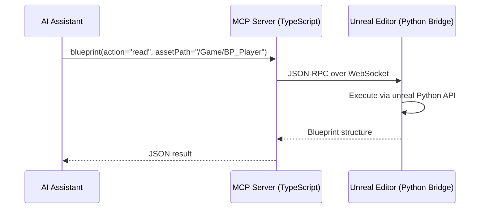
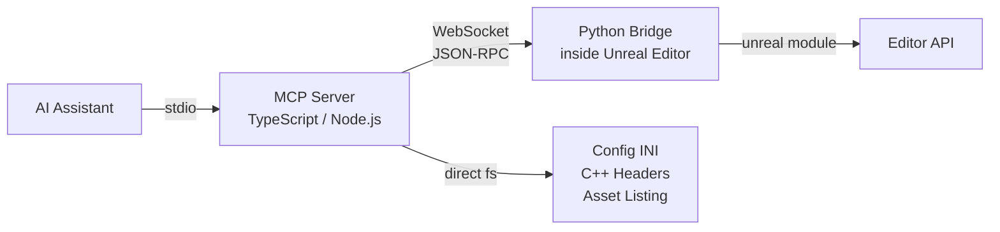

# UE-MCP: Unreal Engine Model Context Protocol Server

A TypeScript MCP server that gives AI assistants deep read/write access to Unreal Engine projects through 16 category tools covering 185+ actions.

Connects to a running Unreal Editor via a WebSocket bridge plugin for full read/write access with undo, compilation, runtime reflection, and PIE introspection. Filesystem-based operations (config INI, C++ headers, asset listing) work without the editor.



## Quick Start

### 1. Install dependencies

Requires [Node.js](https://nodejs.org/) 18+.

```bash
git clone https://github.com/db-lyon/ue-mcp.git
cd ue-mcp
npm install
npm run build
```

### 2. Configure your MCP client

Add to your MCP configuration (e.g. Cursor `mcp.json` or Claude Desktop `claude_desktop_config.json`), passing your `.uproject` path as an argument:

```json
{
  "mcpServers": {
    "ue-mcp": {
      "command": "node",
      "args": [
        "C:/path/to/ue-mcp/dist/index.js",
        "C:/Users/you/Unreal Projects/MyGame/MyGame.uproject"
      ]
    }
  }
}
```

On first run, the server automatically:
- Detects the engine version from `.uproject`
- Enables `PythonScriptPlugin` if needed
- Deploys the WebSocket bridge to `Content/Python/ue_mcp_bridge/`
- Configures `DefaultEngine.ini` for auto-start on editor launch
- Installs `websockets` in UE's bundled Python
- Connects to the editor if running

**After the first launch, restart the editor once** so the bridge startup script runs. From then on it starts automatically with the editor.

### 3. Verify the bridge (optional)

In the editor, open **Window > Developer Tools > Output Log** and filter on `LogPython`:

```
LogPython: [UE-MCP] Bridge server started on ws://localhost:9877
LogPython: [UE-MCP] Bridge listening on ws://localhost:9877
```

If nothing shows up, start it manually in the Output Log's Python console:

```python
import ue_mcp_bridge; ue_mcp_bridge.start()
```

## Architecture



- **MCP Server** (TypeScript): Handles MCP protocol, tool registration, project context, and filesystem operations.
- **Python Bridge** (runs inside Unreal Editor): WebSocket server using the `unreal` Python module. Handles all editor-specific operations -- blueprints, actors, materials, compilation, PIE, etc.
- **Filesystem tools**: Config INI parsing, C++ header analysis, asset directory listing -- these work without the editor.

## Tools Reference (18 tools, 220+ actions)

Every tool takes an `action` parameter that selects the operation, plus action-specific parameters.

<details>
<summary><code>project</code> -- Status, config INI, C++ source inspection</summary>

| Action | Description | Key Params |
|--------|-------------|------------|
| `get_status` | Server mode and editor connection status | |
| `set_project` | Switch to a UE project, auto-deploys bridge | `projectPath` |
| `get_info` | Read `.uproject` file details | |
| `read_config` | Parse an INI config file | `configName` |
| `search_config` | Search all INI files for a string | `query` |
| `list_config_tags` | Extract gameplay tags from config | |
| `set_config` | Write to an INI file | `configName`, `section`, `key`, `value` |
| `read_cpp_header` | Parse a `.h` file for UCLASS/USTRUCT/UENUM/UPROPERTY/UFUNCTION | `headerPath` |
| `read_module` | Read C++ module structure and Build.cs | `moduleName` |
| `list_modules` | List all C++ modules in Source/ | |
| `search_cpp` | Search `.h`/`.cpp` files for text | `query`, `directory?` |

</details>

<details>
<summary><code>asset</code> -- Asset management, import, datatables, textures</summary>

| Action | Description | Key Params |
|--------|-------------|------------|
| `list` | List assets in a directory | `directory?`, `typeFilter?`, `recursive?` |
| `search` | Search by name/class/path | `query`, `directory?`, `maxResults?` |
| `read` | Read asset via reflection | `assetPath` |
| `read_properties` | Read specific properties | `assetPath`, `exportName?`, `propertyName?` |
| `duplicate` | Duplicate asset | `sourcePath`, `destinationPath` |
| `rename` | Rename asset | `assetPath`, `newName` |
| `move` | Move asset | `sourcePath`, `destinationPath` |
| `delete` | Delete asset | `assetPath` |
| `save` | Save asset(s) | `assetPath?` |
| `import_static_mesh` | Import from FBX/OBJ | `filePath`, `name?`, `packagePath?` |
| `import_skeletal_mesh` | Import skeletal mesh from FBX | `filePath`, `skeletonPath?` |
| `import_animation` | Import animation from FBX | `filePath`, `skeletonPath?` |
| `import_texture` | Import PNG/TGA/EXR/HDR | `filePath` |
| `read_datatable` | Read DataTable rows | `assetPath`, `rowFilter?` |
| `create_datatable` | Create DataTable | `name`, `rowStruct` |
| `reimport_datatable` | Reimport from JSON | `assetPath`, `jsonPath?`, `jsonString?` |
| `list_textures` | List texture assets | `directory?`, `recursive?` |
| `get_texture_info` | Texture details | `assetPath` |
| `set_texture_settings` | Set texture properties | `assetPath`, `settings` |

</details>

<details>
<summary><code>blueprint</code> -- Reading, authoring, and compilation</summary>

| Action | Description | Key Params |
|--------|-------------|------------|
| `read` | Full BP structure | `assetPath` |
| `list_variables` | List variables with types and flags | `assetPath` |
| `list_functions` | List functions and graphs | `assetPath` |
| `read_graph` | Read graph nodes and connections | `assetPath`, `graphName` |
| `create` | Create Blueprint | `assetPath`, `parentClass?` |
| `add_variable` | Add variable | `assetPath`, `name`, `varType` |
| `set_variable_properties` | Edit variable flags | `assetPath`, `name`, `instanceEditable?`, `category?` |
| `create_function` | Create function graph | `assetPath`, `functionName` |
| `delete_function` | Delete function | `assetPath`, `functionName` |
| `rename_function` | Rename function | `assetPath`, `oldName`, `newName` |
| `add_node` | Add graph node | `assetPath`, `nodeClass`, `graphName?` |
| `delete_node` | Remove node | `assetPath`, `graphName`, `nodeName` |
| `set_node_property` | Set node property | `assetPath`, `graphName`, `nodeName`, `propertyName`, `value` |
| `connect_pins` | Wire two nodes | `assetPath`, `sourceNode`, `sourcePin`, `targetNode`, `targetPin` |
| `add_component` | Add BP component | `assetPath`, `componentClass` |
| `compile` | Compile Blueprint | `assetPath` |
| `list_node_types` | List node types by category | `category?` |
| `search_node_types` | Search for node types | `query` |
| `create_interface` | Create BP Interface | `assetPath` |
| `add_interface` | Implement interface | `blueprintPath`, `interfacePath` |
| `add_event_dispatcher` | Add event dispatcher | `blueprintPath`, `name` |

</details>

<details>
<summary><code>level</code> -- Actors, selection, components, volumes, lights, splines</summary>

| Action | Description | Key Params |
|--------|-------------|------------|
| `get_outliner` | List all actors | `classFilter?`, `nameFilter?` |
| `place_actor` | Spawn actor | `actorClass`, `location?`, `rotation?`, `label?` |
| `delete_actor` | Remove actor | `actorLabel` |
| `get_actor_details` | Inspect actor | `actorLabel` |
| `move_actor` | Transform actor | `actorLabel`, `location?`, `rotation?`, `scale?` |
| `select` | Select actors | `actorLabels[]` |
| `get_selected` | Get selection | |
| `add_component` | Add component to actor | `actorLabel`, `componentClass` |
| `set_component_property` | Set component property | `actorLabel`, `componentName`, `propertyName`, `value` |
| `get_current` | Current level info | |
| `load` | Open level | `levelPath` |
| `save` | Save level | |
| `list` | List map assets | |
| `create` | Create empty level | |
| `spawn_volume` | Place volume | `volumeType`, `location?`, `extent?` |
| `list_volumes` | List volumes | `volumeType?` |
| `set_volume_properties` | Edit volume | `actorLabel`, `properties` |
| `spawn_light` | Place light | `lightType`, `location?`, `intensity?`, `color?` |
| `set_light_properties` | Edit light | `actorLabel`, `intensity?`, `color?`, `temperature?` |
| `build_lighting` | Build lights | `quality?` |
| `get_spline_info` | Read spline | `actorLabel` |
| `set_spline_points` | Set spline points | `actorLabel`, `points[]`, `closedLoop?` |

</details>

<details>
<summary><code>material</code> -- Materials, instances, shading, graph authoring</summary>

| Action | Description | Key Params |
|--------|-------------|------------|
| `read` | Read material structure | `assetPath` |
| `list_parameters` | List overridable parameters | `assetPath` |
| `set_parameter` | Set scalar/vector/texture parameter | `assetPath`, `parameterName`, `value` |
| `create_instance` | Create material instance | `parentPath`, `name?` |
| `create` | Create material | `name`, `packagePath?` |
| `set_shading_model` | Set shading model | `assetPath`, `shadingModel` |
| `set_base_color` | Set base color | `assetPath`, `color {r,g,b}` |
| `connect_texture` | Wire texture to property | `materialPath`, `texturePath`, `property` |

</details>

<details>
<summary><code>animation</code> -- Anim assets, skeletons, montages, blendspaces</summary>

| Action | Description | Key Params |
|--------|-------------|------------|
| `read_anim_blueprint` | Read AnimBP structure | `assetPath` |
| `read_montage` | Read montage | `assetPath` |
| `read_sequence` | Read anim sequence | `assetPath` |
| `read_blendspace` | Read blendspace | `assetPath` |
| `list` | List anim assets | `directory?`, `recursive?` |
| `create_montage` | Create montage from sequence | `animSequencePath` |
| `create_anim_blueprint` | Create AnimBP | `skeletonPath` |
| `create_blendspace` | Create blendspace | `skeletonPath` |
| `add_notify` | Add notify event | `assetPath`, `notifyName`, `triggerTime` |
| `get_skeleton_info` | Read skeleton | `assetPath` |
| `list_sockets` | List sockets | `assetPath` |
| `list_skeletal_meshes` | List skeletal meshes | `directory?` |
| `get_physics_asset` | Read physics asset | `assetPath` |

</details>

<details>
<summary><code>landscape</code> -- Terrain sculpting, painting, layers</summary>

| Action | Description | Key Params |
|--------|-------------|------------|
| `get_info` | Landscape setup | |
| `list_layers` | List paint layers | |
| `sample` | Sample height/layers at point | `x`, `y` |
| `list_splines` | Read landscape splines | |
| `get_component` | Inspect component | `componentIndex` |
| `sculpt` | Sculpt heightmap | `x`, `y`, `radius`, `strength` |
| `paint_layer` | Paint weight layer | `layerName`, `x`, `y`, `radius` |
| `set_material` | Set landscape material | `materialPath` |
| `add_layer_info` | Register paint layer | `layerName` |
| `import_heightmap` | Import heightmap file | `filePath` |

</details>

<details>
<summary><code>pcg</code> -- Procedural Content Generation</summary>

| Action | Description | Key Params |
|--------|-------------|------------|
| `list_graphs` | List PCG graph assets | `directory?` |
| `read_graph` | Read graph structure | `assetPath` |
| `read_node_settings` | Read node settings | `assetPath`, `nodeName` |
| `get_components` | List PCG components in level | |
| `get_component_details` | Inspect component | `actorLabel` |
| `create_graph` | Create PCG graph | `name` |
| `add_node` | Add node | `assetPath`, `nodeType` |
| `connect_nodes` | Wire nodes | `assetPath`, `sourceNode`, `sourcePin`, `targetNode`, `targetPin` |
| `set_node_settings` | Set node parameters | `assetPath`, `nodeName`, `settings` |
| `remove_node` | Remove node | `assetPath`, `nodeName` |
| `execute` | Regenerate PCG | `actorLabel` |
| `add_volume` | Place PCG volume | `graphPath`, `location?`, `extent?` |

</details>

<details>
<summary><code>foliage</code> -- Foliage painting, types, settings</summary>

| Action | Description | Key Params |
|--------|-------------|------------|
| `list_types` | List foliage types in level | |
| `get_settings` | Read foliage type settings | `foliageTypeName` |
| `sample` | Query instances in region | `center {x,y,z}`, `radius` |
| `paint` | Add foliage | `foliageType`, `center`, `radius` |
| `erase` | Remove foliage | `center`, `radius` |
| `create_type` | Create from StaticMesh | `meshPath` |
| `set_settings` | Modify type settings | `foliageTypeName`, `settings` |

</details>

<details>
<summary><code>niagara</code> -- VFX systems and graph authoring</summary>

| Action | Description | Key Params |
|--------|-------------|------------|
| `list` | List Niagara assets | `directory?` |
| `get_info` | Inspect system | `assetPath` |
| `spawn` | Spawn VFX at location | `systemPath`, `location` |
| `set_parameter` | Set parameter on component | `actorLabel`, `parameterName`, `value` |
| `create` | Create Niagara System | `name` |

</details>

<details>
<summary><code>audio</code> -- Sound assets and playback</summary>

| Action | Description | Key Params |
|--------|-------------|------------|
| `list` | List sound assets | `directory?` |
| `play_at_location` | Play sound at location | `soundPath`, `location` |
| `spawn_ambient` | Place ambient sound actor | `soundPath`, `location` |
| `create_cue` | Create SoundCue | `name`, `soundWavePath?` |
| `create_metasound` | Create MetaSoundSource | `name` |

</details>

<details>
<summary><code>widget</code> -- UMG widgets and editor utilities</summary>

| Action | Description | Key Params |
|--------|-------------|------------|
| `read_tree` | Read widget hierarchy | `assetPath` |
| `get_details` | Inspect widget | `assetPath`, `widgetName` |
| `set_property` | Set widget property | `assetPath`, `widgetName`, `propertyName`, `value` |
| `list` | List Widget Blueprints | `directory?` |
| `read_animations` | Read UMG animations | `assetPath` |
| `create` | Create Widget Blueprint | `name` |
| `create_utility_widget` | Create editor panel | `name` |
| `run_utility_widget` | Open editor panel | `assetPath` |
| `create_utility_blueprint` | Create editor script | `name` |
| `run_utility_blueprint` | Run editor script | `assetPath` |

</details>

<details>
<summary><code>editor</code> -- Console, Python, PIE, viewport, sequencer, performance, pipeline, logs</summary>

| Action | Description | Key Params |
|--------|-------------|------------|
| `execute_command` | Run console command | `command` |
| `execute_python` | Run Python in editor (escape hatch) | `code` |
| `set_property` | Set UObject property | `objectPath`, `propertyName`, `value` |
| `play_in_editor` | PIE control | `pieAction` (start/stop/status) |
| `get_runtime_value` | Read PIE actor value | `actorLabel`, `propertyName` |
| `hot_reload` | Hot reload C++ | |
| `undo` | Undo last transaction | |
| `redo` | Redo | |
| `get_perf_stats` | Editor performance stats | |
| `run_stat` | Toggle stat overlay | `command` |
| `set_scalability` | Set quality level | `level` |
| `capture_screenshot` | Screenshot | `filename?`, `resolution?` |
| `get_viewport` | Get viewport camera | |
| `set_viewport` | Set viewport camera | `location?`, `rotation?` |
| `focus_on_actor` | Focus on actor | `actorLabel` |
| `create_sequence` | Create Level Sequence | `name` |
| `get_sequence_info` | Read sequence | `assetPath` |
| `add_sequence_track` | Add track | `assetPath`, `trackType`, `actorLabel?` |
| `play_sequence` | Play/stop/pause | `assetPath`, `sequenceAction` |

</details>

<details>
<summary><code>reflection</code> -- UE class/struct/enum reflection, gameplay tags</summary>

| Action | Description | Key Params |
|--------|-------------|------------|
| `reflect_class` | Reflect UClass | `className`, `includeInherited?` |
| `reflect_struct` | Reflect UScriptStruct | `structName` |
| `reflect_enum` | Reflect UEnum | `enumName` |
| `list_classes` | List classes | `parentFilter?`, `limit?` |
| `list_tags` | List gameplay tags | `filter?` |
| `create_tag` | Create gameplay tag | `tag`, `comment?` |

</details>

<details>
<summary><code>gameplay</code> -- Physics, collision, navigation, input, behavior trees, AI, game framework</summary>

| Action | Description | Key Params |
|--------|-------------|------------|
| `set_collision_profile` | Set collision preset | `actorLabel`, `profileName` |
| `set_simulate_physics` | Toggle physics | `actorLabel`, `simulate` |
| `set_collision_enabled` | Set collision mode | `actorLabel`, `collisionEnabled` |
| `set_physics_properties` | Set mass/damping/gravity | `actorLabel`, `mass?`, `linearDamping?` |
| `rebuild_navigation` | Rebuild navmesh | |
| `get_navmesh_info` | Query nav system | |
| `project_to_nav` | Project point to navmesh | `location` |
| `spawn_nav_modifier` | Place nav modifier | `location`, `extent?`, `areaClass?` |
| `create_input_action` | Create InputAction | `name`, `valueType?` |
| `create_input_mapping` | Create InputMappingContext | `name` |
| `list_input_assets` | List input assets | `directory?` |
| `list_behavior_trees` | List BTs and Blackboards | `directory?` |
| `get_behavior_tree_info` | Inspect BT | `assetPath` |
| `create_blackboard` | Create Blackboard | `name` |
| `create_behavior_tree` | Create BT | `name`, `blackboardPath?` |

</details>

<details>
<summary><code>gas</code> -- Gameplay Ability System</summary>

| Action | Description | Key Params |
|--------|-------------|------------|
| `add_asc` | Add AbilitySystemComponent | `blueprintPath` |
| `create_attribute_set` | Create AttributeSet BP | `name`, `packagePath?` |
| `add_attribute` | Add attribute to set | `attributeSetPath`, `attributeName` |
| `create_ability` | Create GameplayAbility BP | `name`, `parentClass?` |
| `set_ability_tags` | Set activation/cancel/block tags | `abilityPath`, `ability_tags?`, `activation_required_tags?` |
| `create_effect` | Create GameplayEffect BP | `name`, `durationPolicy?` |
| `set_effect_modifier` | Add modifier to effect | `effectPath`, `attribute`, `operation?`, `magnitude?` |
| `create_cue` | Create GameplayCue notify | `name`, `cueType?` (Static/Actor) |
| `get_info` | Inspect GAS setup on BP | `blueprintPath` |

</details>

<details>
<summary><code>networking</code> -- Replication and networking</summary>

| Action | Description | Key Params |
|--------|-------------|------------|
| `set_replicates` | Enable actor replication | `blueprintPath`, `replicates?` |
| `set_property_replicated` | Mark variable as replicated | `blueprintPath`, `propertyName` |
| `configure_net_frequency` | Set net update frequency | `blueprintPath`, `netUpdateFrequency?` |
| `set_dormancy` | Set net dormancy mode | `blueprintPath`, `dormancy` |
| `set_net_load_on_client` | Control client loading | `blueprintPath`, `loadOnClient?` |
| `set_always_relevant` | Always network relevant | `blueprintPath`, `alwaysRelevant?` |
| `set_only_relevant_to_owner` | Only relevant to owner | `blueprintPath`, `onlyRelevantToOwner?` |
| `configure_cull_distance` | Net cull distance | `blueprintPath`, `netCullDistanceSquared?` |
| `set_priority` | Net priority | `blueprintPath`, `netPriority?` |
| `set_replicate_movement` | Replicate movement | `blueprintPath`, `replicateMovement?` |
| `get_info` | Get networking config | `blueprintPath` |

</details>

<details>
<summary><code>demo</code> -- Neon Shrine demo scene</summary>

| Action | Description | Key Params |
|--------|-------------|------------|
| `step` | Execute demo step (omit stepIndex for step list) | `stepIndex?` |
| `cleanup` | Remove demo assets and actors | |

</details>

## Ontology

The `.kantext/` directory contains a compositional ontology that models UE concepts, the MCP's tool surface, cross-cutting traits, and development workflows:

| File | Purpose |
|------|---------|
| `Kantext.kant` | Root config + MCP identity + signal definitions |
| `UEConcepts.kant` | Asset taxonomy, type system, relationships, module system, config system |
| `BlueprintOntology.kant` | Blueprint internal anatomy + editor state machines |
| `Traits.kant` | Cross-cutting concerns: replication, serialization, GC, threading, Blueprint exposure |
| `Workflows.kant` | Common development workflows as tool-call sequences |
| `McpSurface.kant` | Tool surface with discovery links back to concepts and workflows |

## Supported Engine Versions

The Python bridge works with any UE version that ships `PythonScriptPlugin` (UE 4.26+). Tested with UE 5.4 through 5.7.

## License

MIT
