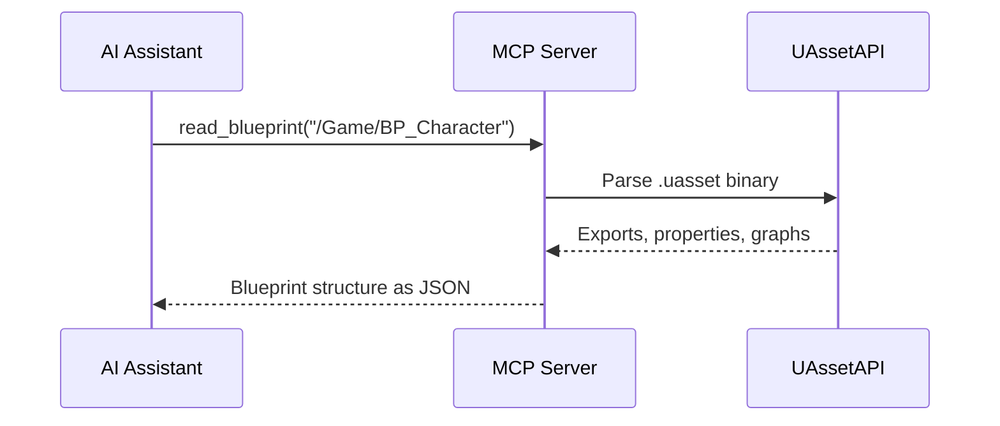
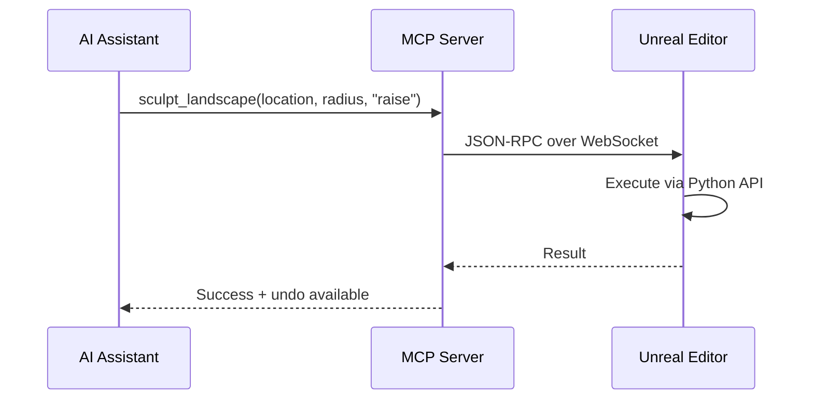

# UE-MCP: Unreal Engine Model Context Protocol Server

A hybrid MCP server that gives AI assistants deep read/write access to Unreal Engine projects — **Windows only**.

Operates in two modes, switching automatically based on whether the editor is running:

- **Offline mode** parses raw `.uasset` / `.umap` binaries using [UAssetAPI](https://github.com/atenfyr/UAssetAPI). Reads C++ headers, config files, and module structure. No Unreal Editor required.
- **Live mode** connects to a running Unreal Editor via a WebSocket bridge plugin for full read/write access with undo, compilation, runtime reflection, and PIE introspection.

## **Offline** (no editor required)



## **Live** (connected to a running editor)



## Quick Start

### 1. Download

Grab `ue-mcp-windows-x64.zip` from [Releases](https://github.com/db-lyon/ue-mcp/releases) and extract it anywhere. No dependencies. The binary is self-contained.

<details>
<summary>Building from source</summary>

Requires [.NET 8.0 SDK](https://dotnet.microsoft.com/download/dotnet/8.0) and Git.

```bash
git clone --recursive https://github.com/db-lyon/ue-mcp.git
cd ue-mcp
dotnet publish src/UeMcp/UeMcp.csproj -c Release -o dist/ --self-contained -r win-x64 -p:PublishSingleFile=true
```

Point your MCP config at `dist/ue-mcp.exe`.

</details>

### 2. Configure your MCP client

Add to your MCP configuration (e.g., Cursor `mcp.json` or Claude Desktop `claude_desktop_config.json`):

```json
{
  "mcpServers": {
    "ue-mcp": {
      "command": "C:\\path\\to\\ue-mcp.exe"
    }
  }
}
```

### 3. Point it at your UE project

Once the AI assistant is connected, the first thing it should do:

```
set_project("C:/Users/you/Unreal Projects/MyGame/MyGame.uproject")
```

This automatically:
- Detects the engine version from the `.uproject`
- Enables `PythonScriptPlugin` if needed
- Deploys the WebSocket bridge to `Content/Python/ue_mcp_bridge/`
- Configures `DefaultEngine.ini` for auto-start on editor launch
- Installs `websockets` in UE's bundled Python
- Connects to the editor if it's running

**After the first `set_project`, restart the editor once** so the bridge startup script runs. From then on, the bridge starts automatically with the editor.

### 4. Verify the bridge (optional)

In the editor, open **Window > Developer Tools > Output Log** and filter on `LogPython`. On a successful launch:

```
LogPython: [UE-MCP] Bridge server started on ws://localhost:9877
LogPython: [UE-MCP] Bridge listening on ws://localhost:9877
```

When the MCP connects:

```
LogPython: [UE-MCP] Client connected from ('127.0.0.1', ...)
```

If nothing shows up, the startup script didn't run. You can start it manually by switching the Output Log to **Python** mode and running:

```python
import ue_mcp_bridge; ue_mcp_bridge.start()
```

## How It Works

1. On startup, the MCP server begins in **offline mode**
2. When `set_project` is called, it:
   - Parses the `.uproject` to detect the engine version
   - Deploys the bridge plugin (enables PythonScriptPlugin, deploys files, configures auto-start, installs websockets)
   - Attempts a WebSocket connection to `ws://localhost:9877`
   - If the editor bridge is running → switches to **live mode**
   - If not → stays in **offline mode**, retries every 15 seconds
3. In live mode, read operations first try the bridge (richer data from editor reflection), falling back to offline parsing on failure
4. Write operations (compile, create, modify) are **only available in live mode** since they require the editor to execute safely

## Tools Reference

### Status & Project

| Tool | Mode | Description |
|------|------|-------------|
| `get_status` | Both | Server mode, connection status, loaded project info |
| `set_project` | Both | Point the server at a UE project, auto-deploys bridge plugin |
| `get_project_info` | Both | Read the `.uproject` file contents |

### Asset Reading

| Tool | Mode | Description |
|------|------|-------------|
| `read_asset` | Both | Read any asset's full structure as JSON |
| `read_asset_properties` | Offline | Read specific properties from a named export |
| `list_assets` | Both | List assets in a directory with optional type filter |
| `search_assets` | Both | Search assets by name/content across the project |
| `asset_to_json` | Offline | Export full asset via UAssetAPI's native JSON serializer |

### Blueprints

| Tool | Mode | Description |
|------|------|-------------|
| `read_blueprint` | Both | Full Blueprint structure: parent class, variables, functions, graphs, components |
| `list_blueprint_variables` | Both | All variables with types, flags, and default values |
| `list_blueprint_functions` | Both | All functions with parameters and bytecode size |
| `read_blueprint_graph` | Both | Nodes and connections within a specific graph |
| `set_blueprint_variable_properties` | Live | Set variable visibility, replication, category, tooltip |
| `create_blueprint_function` | Live | Create a new function graph in a Blueprint |
| `delete_blueprint_function` | Live | Delete a function graph from a Blueprint |
| `rename_blueprint_function` | Live | Rename a function or graph in a Blueprint |
| `delete_blueprint_node` | Live | Remove a node from a Blueprint graph |
| `set_blueprint_node_property` | Live | Set a property on a Blueprint graph node |
| `add_blueprint_component` | Live | Add a component (mesh, collision, audio, etc.) to a Blueprint |

### DataTables

| Tool | Mode | Description |
|------|------|-------------|
| `read_datatable` | Both | Read DataTable rows and column structure with optional row filter |
| `reimport_datatable` | Live | Reimport a DataTable from a JSON file or JSON string, auto-saves |

### Reflection (Live Mode)

| Tool | Mode | Description |
|------|------|-------------|
| `reflect_class` | Live | Reflect a UClass: parent chain, properties, functions, flags, interfaces |
| `reflect_struct` | Live | Reflect a UScriptStruct: fields with types |
| `reflect_enum` | Live | Reflect a UEnum: all values with display names |
| `list_classes` | Live | List classes, optionally filtered by parent class |
| `list_gameplay_tags` | Live | Full GameplayTag hierarchy, filterable by prefix |

### Node Discovery (Live Mode)

| Tool | Mode | Description |
|------|------|-------------|
| `list_node_types` | Live | List Blueprint node types by category (Flow Control, Events, Functions, etc.) |
| `search_node_types` | Live | Search for node types by name or description |

### Config / INI

| Tool | Mode | Description |
|------|------|-------------|
| `read_config` | Offline | Parse a config/INI file: sections and key-value pairs |
| `search_config` | Offline | Search all config files for keys, values, or sections |
| `list_config_tags` | Offline | GameplayTags defined in config files (offline alternative to `list_gameplay_tags`) |

### C++ Source

| Tool | Mode | Description |
|------|------|-------------|
| `read_cpp_header` | Offline | Parse a .h file for UCLASS, USTRUCT, UENUM, UPROPERTY, UFUNCTION |
| `read_module` | Offline | Module structure: Build.cs deps, headers, sources |
| `list_modules` | Offline | All C++ modules with types, file counts, dependencies |
| `search_cpp` | Offline | Search C++ source for symbols, macros, or text |

### Level / World (Live Mode)

| Tool | Mode | Description |
|------|------|-------------|
| `get_world_outliner` | Live | List all actors in the level with class, transform, folder |
| `place_actor` | Live | Spawn an actor with class, position, rotation, label |
| `delete_actor` | Live | Remove an actor by name or label |
| `get_actor_details` | Live | Detailed actor info: components, tags, properties |
| `move_actor` | Live | Relocate, rotate, or rescale an actor |

### Materials (Live Mode)

| Tool | Mode | Description |
|------|------|-------------|
| `read_material` | Live | Read material structure: parent, shading model, parameters |
| `list_material_parameters` | Live | All overridable parameters with current values |
| `set_material_parameter` | Live | Set scalar, vector, or texture parameter on a material instance |
| `create_material_instance` | Live | Create a new material instance from a parent |

### Animation (Live Mode)

| Tool | Mode | Description |
|------|------|-------------|
| `read_anim_blueprint` | Live | Read Anim BP: target skeleton, parent, state machines, variables |
| `read_anim_montage` | Live | Read montage: sections, notifies, slot tracks, blend times |
| `read_anim_sequence` | Live | Read sequence: length, frames, rate, notifies, curves |
| `read_blendspace` | Live | Read blendspace: axes, sample points with animations |
| `list_anim_assets` | Live | List montages, sequences, blendspaces, anim BPs in a directory |
| `add_anim_notify` | Live | Add a notify to a montage or sequence at a specific time |

### Widgets / UMG (Live Mode)

| Tool | Mode | Description |
|------|------|-------------|
| `read_widget_tree` | Live | Full widget hierarchy with class, visibility, slot info |
| `get_widget_details` | Live | Detailed widget properties: text, font, color, image, progress |
| `set_widget_property` | Live | Set widget property: visibility, text, color, opacity, etc. |
| `list_widget_blueprints` | Live | List Widget Blueprints in a directory |
| `read_widget_animations` | Live | Read UMG animations: names, lengths, bindings |

### PCG / Procedural Content Generation (Live Mode)

| Tool | Mode | Description |
|------|------|-------------|
| `list_pcg_graphs` | Live | List PCG graph assets in a directory |
| `read_pcg_graph` | Live | Full PCG graph structure: nodes, edges, parameters |
| `read_pcg_node_settings` | Live | Detailed settings of a specific PCG node |
| `get_pcg_components` | Live | List PCG components in the level with graph, seed, trigger |
| `get_pcg_component_details` | Live | Deep inspect a PCG component: settings, resources, state |
| `create_pcg_graph` | Live | Create a new PCG graph asset |
| `add_pcg_node` | Live | Add a node (sampler, filter, spawner, etc.) to a PCG graph |
| `connect_pcg_nodes` | Live | Wire PCG nodes together via pins |
| `set_pcg_node_settings` | Live | Set/update parameters on a PCG node |
| `remove_pcg_node` | Live | Remove a node and its connections |
| `execute_pcg_graph` | Live | Trigger PCG regeneration on a level actor |
| `add_pcg_volume` | Live | Place a PCG volume with graph, bounds, and seed |

### Landscape (Live Mode)

| Tool | Mode | Description |
|------|------|-------------|
| `get_landscape_info` | Live | Landscape setup: components, resolution, material, size |
| `list_landscape_layers` | Live | All paint/weight layers with physical materials and blend type |
| `sample_landscape` | Live | Height, normal, and layer weights at world coordinates |
| `list_landscape_splines` | Live | Landscape spline control points and segments |
| `get_landscape_component` | Live | Inspect a landscape component by grid coordinates |
| `sculpt_landscape` | Live | Sculpt the heightmap: raise, lower, smooth, flatten, noise |
| `paint_landscape_layer` | Live | Paint a weight layer at a location |
| `set_landscape_material` | Live | Set the landscape's material |
| `add_landscape_layer_info` | Live | Register a new paint layer on the landscape |
| `import_landscape_heightmap` | Live | Import a heightmap from a raw/png file |

### Foliage (Live Mode)

| Tool | Mode | Description |
|------|------|-------------|
| `list_foliage_types` | Live | List all foliage types in the level with mesh and settings |
| `get_foliage_type_settings` | Live | Full foliage type settings: density, scale, slope, cull, etc. |
| `sample_foliage` | Live | Query foliage instances in a region for density verification |
| `paint_foliage` | Live | Add foliage instances with optional landscape layer filter |
| `erase_foliage` | Live | Remove foliage instances in a radius |
| `set_foliage_type_settings` | Live | Modify foliage type settings (partial update) |

### Editor (Live Mode)

| Tool | Mode | Description |
|------|------|-------------|
| `editor_execute` | Live | Run a console command in the editor |
| `execute_python` | Live | Run arbitrary Python in the editor's environment (escape hatch for anything) |
| `set_property` | Live | Set a property value with undo support |
| `undo` | Live | Undo last editor action(s). Reverts any mutation |
| `redo` | Live | Redo last undone action(s) |
| `compile_blueprint` | Live | Compile a Blueprint and get error feedback |
| `create_blueprint` | Live | Create a new Blueprint with specified parent class |
| `add_blueprint_variable` | Live | Add a variable to a Blueprint |
| `add_blueprint_node` | Live | Add a node to a Blueprint graph |
| `connect_blueprint_pins` | Live | Wire two pins between nodes |
| `play_in_editor` | Live | Start/stop/query PIE sessions |
| `get_runtime_value` | Live | Read actor property values during PIE |
| `hot_reload` | Live | Trigger Live Coding compile (Ctrl+Alt+F11) without restarting the editor |
| `save_asset` | Live | Save one or all modified assets |

## Ontology

The `.kantext/` directory contains a compositional ontology that models UE concepts, the MCP's tool surface, cross-cutting traits, and development workflows:

| File | Purpose |
|------|---------|
| `Kantext.kant` | Root config + MCP identity + signal definitions |
| `UEConcepts.kant` | Asset taxonomy, type system, relationships, module system, config system |
| `BlueprintOntology.kant` | Blueprint internal anatomy + editor state machines |
| `Traits.kant` | Cross-cutting concerns: replication, serialization, GC, threading, Blueprint exposure |
| `Workflows.kant` | Common development workflows as tool-call sequences |
| `McpSurface.kant` | Tool surface with discovery links back to concepts and workflows |

The ontology follows a reflection-first design. Concepts are organized around what the tools discover, with `discover_via` links connecting concepts to the tools that reveal them.

## Supported Engine Versions

Offline mode (via UAssetAPI) supports: **UE 4.13 through 5.7+**

Live mode supports whatever version of Unreal Editor you're running. It uses the editor's own reflection system.

## License

MIT
