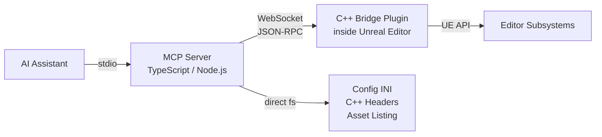

# UE-MCP

**Unreal Engine Model Context Protocol Server** - gives AI assistants deep read/write access to the Unreal Editor through 19 category tools covering 440+ actions.


```mermaid
flowchart LR
    AI[AI Assistant] -->|stdio| MCP[MCP Server<br/>TypeScript / Node.js]
    MCP -->|WebSocket<br/>JSON-RPC| Plugin[C++ Bridge Plugin<br/>inside Unreal Editor]
    Plugin -->|UE API| Editor[Editor Subsystems]
    MCP -->|direct fs| FS[Config INI<br/>C++ Headers<br/>Asset Listing]
```

Blueprints, materials, levels, actors, animation, VFX, landscape, PCG, foliage, audio, UI, physics, navigation, AI, GAS, networking, sequencer, build pipeline — all programmable through natural language.

## Quick Start

```bash
npx ue-mcp init
```

The interactive setup will:

1. Find your `.uproject` (auto-detects in current directory)
2. Let you choose which tool categories to enable
3. Deploy the C++ bridge plugin to your project
4. Enable required UE plugins (Niagara, PCG, GAS, etc.)
5. Detect and configure your MCP client (Claude Code, Claude Desktop, Cursor)

Restart the editor once after setup to load the bridge plugin. To update later: `npx ue-mcp update`

Then ask your AI:

```
project(action="get_status")        — verify connection
level(action="get_outliner")        — see what's in the level
asset(action="list")                — browse project assets
```

### Manual Configuration

If you prefer to configure manually, add to your MCP client config:

```json
{
  "mcpServers": {
    "ue-mcp": {
      "command": "npx",
      "args": ["ue-mcp", "C:/path/to/MyGame.uproject"]
    }
  }
}
```

## Documentation

**[db-lyon.github.io/ue-mcp](https://db-lyon.github.io/ue-mcp/)**

- [Getting Started](https://db-lyon.github.io/ue-mcp/getting-started/) — Installation, configuration, first run
- [Architecture](https://db-lyon.github.io/ue-mcp/architecture/) — How the pieces fit together
- [Tool Reference](https://db-lyon.github.io/ue-mcp/tool-reference/) - All 19 tools with 440+ actions
- [Configuration](https://db-lyon.github.io/ue-mcp/configuration/) — `.ue-mcp.json` and MCP client config
- [Neon Shrine Demo](https://db-lyon.github.io/ue-mcp/neon-shrine-demo/) — Interactive guided demo
- [Feedback](https://db-lyon.github.io/ue-mcp/feedback/) — Agent feedback system
- [Troubleshooting](https://db-lyon.github.io/ue-mcp/troubleshooting/) — Common issues and fixes
- [Development](https://db-lyon.github.io/ue-mcp/development/) — Building, testing, contributing

## What Can It Do?

| Category | Examples |
|----------|----------|
| **Levels** | Place/move/delete actors, spawn lights and volumes, manage splines, actor bounds |
| **Blueprints** | Read/write graphs, add nodes, connect pins, compile, CDO property access |
| **Materials** | Create materials and instances, author expression graphs |
| **Assets** | CRUD, import meshes/textures/animations, datatables, mesh bounds/collision/nav |
| **Animation** | Anim blueprints, montages, blendspaces, skeletons |
| **VFX** | Niagara systems, emitters, parameters |
| **Landscape** | Sculpt terrain, paint layers, import heightmaps |
| **PCG** | Author and execute Procedural Content Generation graphs |
| **Gameplay** | Physics, collision, navigation, navmesh inspection, behavior trees, EQS, perception, PIE damage |
| **GAS** | Gameplay Ability System — attributes, abilities, effects, cues |
| **Networking** | Replication, dormancy, relevancy, net priority |
| **UI** | UMG widgets, editor utility widgets and blueprints, runtime delegate inspection |
| **Editor** | Console, Python, PIE, viewport, sequencer, build pipeline, logs |
| **Reflection** | Class/struct/enum introspection, gameplay tags |

## Supported Platforms

- **Windows** — UE 5.4–5.7
- **Linux** — UE 5.6+ (contributed by [@robinduckett](https://github.com/robinduckett))

Requires `PythonScriptPlugin` (ships with UE 4.26+).

If you clone this repo to contribute, install [git-lfs](https://git-lfs.com) first - the bundled test project stores `.uasset` / `.umap` via LFS and plain `git clone` will leave them as pointer files.

## Contributing

Issues and pull requests welcome. If an AI agent had to fall back to `execute_python` during your session, it will offer to submit structured feedback automatically — this helps us prioritize which native handlers to add next.

## License

UE-MCP is licensed under the **Business Source License 1.1** with a **commercial license** available for production use outside the Additional Use Grant.

- **Individuals, students, and educational institutions** use UE-MCP free under BUSL-1.1's Additional Use Grant. Each release converts to Apache 2.0 after four years. See [LICENSE](LICENSE).
- **Game studios, publishers, contract developers, and commercial entities** using UE-MCP in proprietary products, internal pipelines, or paid services require a commercial license. See [COMMERCIAL-LICENSE.md](COMMERCIAL-LICENSE.md) and [ue-mcp.com/pricing](https://ue-mcp.com/pricing).

Contributions are accepted under the terms of the Contributor License Agreement. See [CLA.md](CLA.md).
