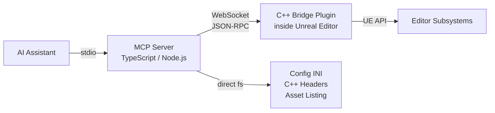

# UE-MCP

**Unreal Engine Model Context Protocol Server** — gives AI assistants deep read/write access to the Unreal Editor through 18 category tools covering 260+ actions.


```mermaid
flowchart LR
    AI[AI Assistant] -->|stdio| MCP[MCP Server<br/>TypeScript / Node.js]
    MCP -->|WebSocket<br/>JSON-RPC| Plugin[C++ Bridge Plugin<br/>inside Unreal Editor]
    Plugin -->|UE API| Editor[Editor Subsystems]
    MCP -->|direct fs| FS[Config INI<br/>C++ Headers<br/>Asset Listing]
```

Blueprints, materials, levels, actors, animation, VFX, landscape, PCG, foliage, audio, UI, physics, navigation, AI, GAS, networking, sequencer, build pipeline — all programmable through natural language.

## Quick Start

```bash
git clone https://github.com/db-lyon/ue-mcp.git
cd ue-mcp
npm install && npm run build
```

Add to your MCP client config (Claude Code, Claude Desktop, Cursor, etc.):

```json
{
  "mcpServers": {
    "ue-mcp": {
      "command": "node",
      "args": [
        "C:/path/to/ue-mcp/dist/index.js",
        "C:/path/to/MyGame.uproject"
      ]
    }
  }
}
```

Restart the editor once after first run to load the C++ bridge plugin. Then:

```
project(action="get_status")        — verify connection
level(action="get_outliner")        — see what's in the level
asset(action="list")                — browse project assets
```

## Documentation

**[db-lyon.github.io/ue-mcp-docs](https://db-lyon.github.io/ue-mcp-docs/)**

- [Getting Started](https://db-lyon.github.io/ue-mcp-docs/getting-started/) — Installation, configuration, first run
- [Architecture](https://db-lyon.github.io/ue-mcp-docs/architecture/) — How the pieces fit together
- [Tool Reference](https://db-lyon.github.io/ue-mcp-docs/tool-reference/) — All 18 tools with every action
- [Configuration](https://db-lyon.github.io/ue-mcp-docs/configuration/) — `.ue-mcp.json` and MCP client config
- [Neon Shrine Demo](https://db-lyon.github.io/ue-mcp-docs/neon-shrine-demo/) — Interactive guided demo
- [Troubleshooting](https://db-lyon.github.io/ue-mcp-docs/troubleshooting/) — Common issues and fixes
- [Development](https://db-lyon.github.io/ue-mcp-docs/development/) — Building, testing, contributing

## Supported Versions

Tested with UE 5.4–5.7. Works with any version that ships `PythonScriptPlugin` (UE 4.26+).

## License

MIT
