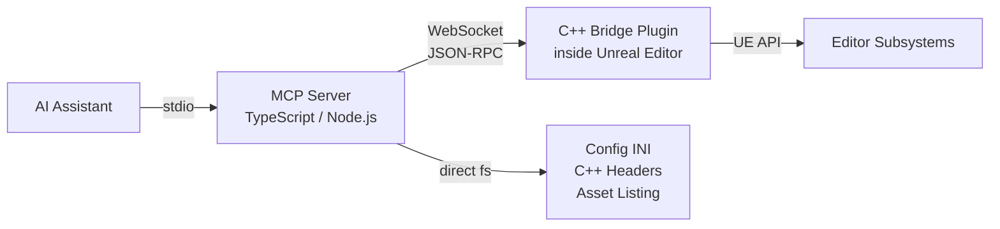

# UE-MCP

**Unreal Engine Model Context Protocol Server** — gives AI assistants deep read/write access to the Unreal Editor through 19 category tools covering 300+ actions.


```mermaid
flowchart LR
    AI[AI Assistant] -->|stdio| MCP[MCP Server<br/>TypeScript / Node.js]
    MCP -->|WebSocket<br/>JSON-RPC| Plugin[C++ Bridge Plugin<br/>inside Unreal Editor]
    Plugin -->|UE API| Editor[Editor Subsystems]
    MCP -->|direct fs| FS[Config INI<br/>C++ Headers<br/>Asset Listing]
```

Blueprints, materials, levels, actors, animation, VFX, landscape, PCG, foliage, audio, UI, physics, navigation, AI, GAS, networking, sequencer, build pipeline — all programmable through natural language.

## Quick Start

```bash
git clone https://github.com/db-lyon/ue-mcp.git
cd ue-mcp
npm install && npm run build
```

Add to your MCP client config (Claude Code, Claude Desktop, Cursor, etc.):

```json
{
  "mcpServers": {
    "ue-mcp": {
      "command": "node",
      "args": [
        "C:/path/to/ue-mcp/dist/index.js",
        "C:/path/to/MyGame.uproject"
      ]
    }
  }
}
```

Restart the editor once after first run to load the C++ bridge plugin. Then:

```
project(action="get_status")        — verify connection
level(action="get_outliner")        — see what's in the level
asset(action="list")                — browse project assets
```

## Documentation

**[db-lyon.github.io/ue-mcp](https://db-lyon.github.io/ue-mcp/)**

- [Getting Started](https://db-lyon.github.io/ue-mcp/getting-started/) — Installation, configuration, first run
- [Architecture](https://db-lyon.github.io/ue-mcp/architecture/) — How the pieces fit together
- [Tool Reference](https://db-lyon.github.io/ue-mcp/tool-reference/) — All 19 tools with every action
- [Configuration](https://db-lyon.github.io/ue-mcp/configuration/) — `.ue-mcp.json` and MCP client config
- [Neon Shrine Demo](https://db-lyon.github.io/ue-mcp/neon-shrine-demo/) — Interactive guided demo
- [Feedback](https://db-lyon.github.io/ue-mcp/feedback/) — Agent feedback system
- [Troubleshooting](https://db-lyon.github.io/ue-mcp/troubleshooting/) — Common issues and fixes
- [Development](https://db-lyon.github.io/ue-mcp/development/) — Building, testing, contributing

## What Can It Do?

| Category | Examples |
|----------|----------|
| **Levels** | Place/move/delete actors, spawn lights and volumes, manage splines |
| **Blueprints** | Read/write graphs, add nodes, connect pins, compile |
| **Materials** | Create materials and instances, author expression graphs |
| **Assets** | CRUD, import meshes/textures/animations, datatables |
| **Animation** | Anim blueprints, montages, blendspaces, skeletons |
| **VFX** | Niagara systems, emitters, parameters |
| **Landscape** | Sculpt terrain, paint layers, import heightmaps |
| **PCG** | Author and execute Procedural Content Generation graphs |
| **Gameplay** | Physics, collision, navigation, behavior trees, EQS, perception |
| **GAS** | Gameplay Ability System — attributes, abilities, effects, cues |
| **Networking** | Replication, dormancy, relevancy, net priority |
| **UI** | UMG widgets, editor utility widgets and blueprints |
| **Editor** | Console, Python, PIE, viewport, sequencer, build pipeline, logs |
| **Reflection** | Class/struct/enum introspection, gameplay tags |

## Supported Versions

Tested with UE 5.4–5.7. Requires `PythonScriptPlugin` (ships with UE 4.26+).

## Contributing

Issues and pull requests welcome. If an AI agent had to fall back to `execute_python` during your session, it will offer to submit structured feedback automatically — this helps us prioritize which native handlers to add next.

## License

MIT — see [LICENSE](LICENSE).
