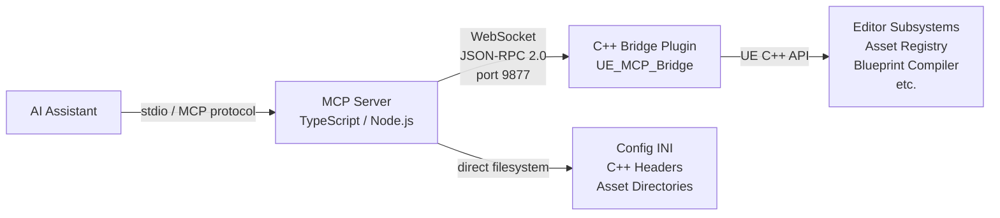
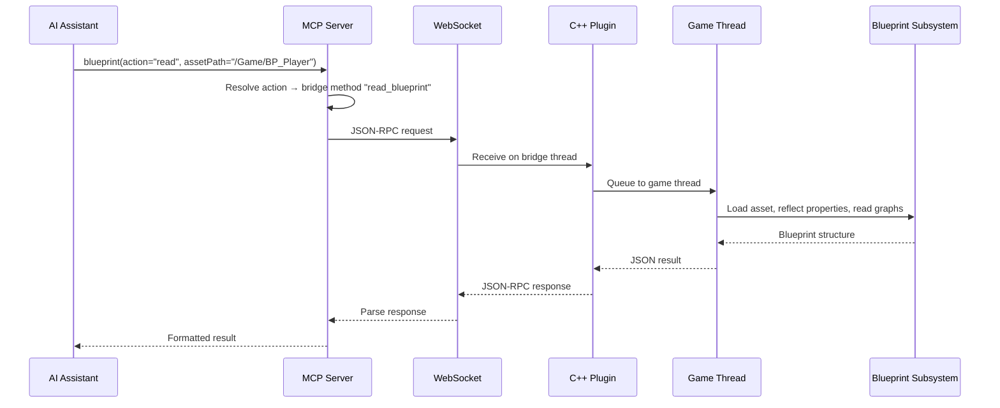

# Architecture

UE-MCP has two main components: a **TypeScript MCP server** that handles the AI protocol, and a **C++ plugin** that runs inside the Unreal Editor and exposes engine APIs over WebSocket.



## MCP Server (TypeScript)

**Entry point:** `src/index.ts`

The server creates an `McpServer` instance (from `@modelcontextprotocol/sdk`), registers <!-- count:tools -->21<!-- /count --> category tools plus a `flow` tool, and communicates with the AI client over stdio.

### Key Modules

| Module | Purpose |
|--------|---------|
| `index.ts` | Tool registration, MCP server lifecycle |
| `tools.ts` | The `ALL_TOOLS` registry consumed by `index.ts` and tests |
| `bridge.ts` | `EditorBridge` (implements `IBridge`) - WebSocket client, JSON-RPC messaging, auto-reconnect |
| `project.ts` | `ProjectContext` - path resolution, INI parsing, C++ header parsing |
| `types.ts` | `ToolDef`, `ActionSpec`, `categoryTool()` factory |
| `schemas.ts` | Shared Zod schemas - `Vec3`, `Rotator`, `Color`, `Quat` |
| `errors.ts` | `McpError` class with `ErrorCode` enum for structured error handling |
| `deployer.ts` | First-run deployment: copy plugin, mutate `.uproject` |
| `editor-control.ts` | Start/stop/restart the Unreal Editor process |
| `instructions.ts` | AI-facing server instructions (embedded documentation) |
| `auth.ts` | GitHub OAuth device flow + `~/.ue-mcp/auth.json` token cache (default authorship path for feedback issues) |
| `github-app.ts` | GitHub App auth used as the bot fallback when OAuth isn't authorized |
| `flow/` | Flow engine (registry, loader, task factory, HTTP server) — see [Flows](flows.md) |
| `init.ts` / `update.ts` / `resolve.ts` / `hook-handler.ts` | CLI subcommands (`npx ue-mcp init`, `update`, `resolve`, `hook`) |

### Tool Registration Pattern

All tools use the `categoryTool()` factory:

```typescript
export const levelTool: ToolDef = categoryTool(
  "level",                              // tool name
  "Actors, selection, components...",    // description
  {
    get_outliner: bp("get_outliner"),           // bridge action
    get_current:  { handler: localHandler },    // local action
  },
  "- get_outliner: List actors...",     // AI-facing docs
);
```

**Two action types:**

- **Bridge actions** (`bp()`) — forwarded to the C++ plugin over WebSocket
- **Local actions** — handled in Node.js (filesystem operations like INI parsing, C++ header reading)

### Bridge Communication

The `EditorBridge` maintains a WebSocket connection to `ws://localhost:9877`.

**Protocol:** JSON-RPC 2.0

```json
// Request
{
  "jsonrpc": "2.0",
  "id": "req-42",
  "method": "get_outliner",
  "params": { "classFilter": "StaticMeshActor" }
}

// Response
{
  "jsonrpc": "2.0",
  "id": "req-42",
  "result": { "actors": [...] }
}
```

- **Timeout:** 30 seconds per request
- **Reconnect:** Automatic every 15 seconds if disconnected
- **Thread safety:** All responses are correlated by request ID

## C++ Bridge Plugin

**Location:** `plugin/ue_mcp_bridge/`
**Module type:** Editor-only

The plugin runs a raw WebSocket server on a dedicated thread, dispatches incoming JSON-RPC requests to registered handler functions, and executes them on the game thread.

### Core Classes

| Class | Purpose |
|-------|---------|
| `FMCPBridgeServer` | WebSocket server (raw platform sockets, Windows + Linux/Mac) |
| `FMCPHandlerRegistry` | Maps method names to C++ handler functions |
| `FMCPGameThreadExecutor` | Queues tasks to the game thread (required for UE API access) |
| `HandlerUtils.h` + `HandlerAssetCreate.h` | Shared utilities - `MCPError`/`MCPSuccess`/`MCPResult`, `RequireString`/`OptionalVec3`/`OptionalRotator`/etc., `FindActorByLabel`/`FindActorByLabelOrName`, `MCPCheckAssetExists`/`MCPCheckActorLabelExists`, `LoadAssetByPath<T>`, `LoadBlueprintCDO<T>`, `MCPCreateAssetIdempotent<T>`, `SaveAssetPackage`. |

### Handler Categories

23 C++ handler groups are registered in `BridgeServer.cpp`. Together they expose <!-- count:actions -->513+<!-- /count --> method names (some of which are aliases mapped onto a smaller number of canonical handlers):

| Handler group | Coverage |
|---------|----------|
| EditorHandlers | Console, Python, PIE, viewport, build, logs, perf, screenshots, scalability |
| AssetHandlers | CRUD, import, search, datatables, textures, sockets, FTS search |
| BlueprintHandlers | Read/write, graphs, compilation, node types, T3D import/export, reparent, validate |
| LevelHandlers | Actors, components, volumes, lights, world settings, splines |
| ReflectionHandlers | Class/struct/enum reflection, gameplay tags |
| MaterialHandlers | Materials, instances, expression graph authoring, declarative builder, render preview |
| AnimationHandlers | Anim BPs, montages, blendspaces, skeletons, IK Rig, ControlRig, virtual bones, live-actor bone reads + leader-pose rebind + preview-animation toggle |
| AudioHandlers | Playback, ambient sounds, SoundCues, MetaSounds |
| WidgetHandlers | UMG widget trees, editor utility widgets and blueprints |
| FoliageHandlers | Foliage types, instance queries |
| LandscapeHandlers | Landscape proxies, layer-info assets, materials |
| NetworkingHandlers | Replication, dormancy, relevancy, net priority |
| NiagaraHandlers | VFX systems, emitters, renderers, data interfaces, GPU HLSL inspection |
| PCGHandlers | Procedural generation graphs, mesh spawner authoring |
| GasHandlers | Gameplay Ability System (attributes, abilities, effects, cues) |
| GameplayHandlers | Physics, collision, navigation, AI (BTs, EQS, perception), input, game framework |
| PhysicsHandlers | Collision profiles, simulation toggles, body properties |
| SequencerHandlers | Level sequences and tracks |
| SplineHandlers | Spline actor authoring |
| DialogHandlers | Modal dialog auto-response policies |
| StateTreeHandlers | StateTree asset authoring (states, transitions, tasks, root parameters) |
| ProjectHandlers | Project info, world subsystem queries |
| DemoHandlers | Neon Shrine demo builder |

### Plugin Dependencies

The C++ plugin links against a wide range of UE modules:

- **Core:** Core, CoreUObject, Engine, Json, JsonUtilities, GameplayTags
- **Editor:** UnrealEd, AssetRegistry, BlueprintGraph, Kismet, KismetCompiler, PropertyEditor
- **Systems:** Landscape, Niagara, PCG, Sequencer, UMG, GameplayAbilities, NavigationSystem, AIModule
- **Tools:** LiveCoding (Windows only), MaterialEditor, EditorScriptingUtilities, DataValidation

## Hybrid Architecture

A key design principle: **read operations work without the editor**.

| Operation Type | Requires Editor? | How |
|----------------|-------------------|-----|
| INI config parsing | No | Direct filesystem |
| C++ header reflection | No | Regex-based parsing |
| Asset directory listing | No | Filesystem scan |
| Blueprint reading | Yes | C++ bridge |
| Actor placement | Yes | C++ bridge |
| Material authoring | Yes | C++ bridge |
| PIE control | Yes | C++ bridge |
| Build pipeline | Yes | C++ bridge |

This means the AI can explore project structure, read configs, and understand C++ code even when the editor isn't running.

## Path Resolution

The `ProjectContext` handles path formats:

| Input | Resolved To |
|-------|-------------|
| `/Game/MyAsset` | `<ProjectDir>/Content/MyAsset` |
| `/MyPlugin/Assets/Foo` | `<ProjectDir>/Plugins/MyPlugin/Content/Assets/Foo` |
| Absolute path | Used as-is |
| Relative path | Relative to project root |

## Data Flow Example

Here's what happens when the AI calls `blueprint(action="read", assetPath="/Game/BP_Player")`:


