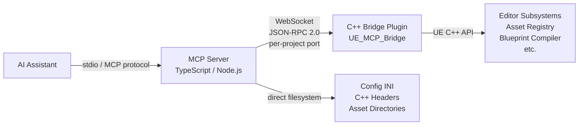
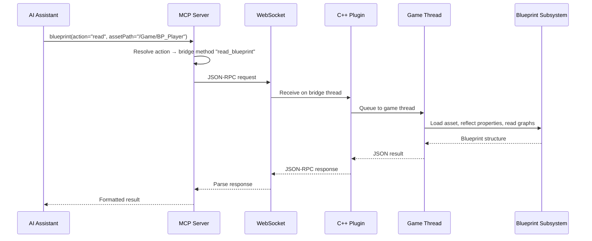

# Architecture

UE-MCP has two main components: a **TypeScript MCP server** that handles the AI protocol, and a **C++ plugin** that runs inside the Unreal Editor and exposes engine APIs over WebSocket.


```mermaid
flowchart LR
    AI[AI Assistant] -->|stdio / MCP protocol| MCP[MCP Server<br/>TypeScript / Node.js]
    MCP -->|WebSocket<br/>JSON-RPC 2.0<br/>per-project port| Plugin[C++ Bridge Plugin<br/>UE_MCP_Bridge]
    Plugin -->|UE C++ API| Engine[Editor Subsystems<br/>Asset Registry<br/>Blueprint Compiler<br/>etc.]
    MCP -->|direct filesystem| FS[Config INI<br/>C++ Headers<br/>Asset Directories]
```

## MCP Server (TypeScript)

**Entry point:** `src/index.ts`

The server creates an `McpServer` instance (from `@modelcontextprotocol/sdk`), registers <!-- count:tools -->26<!-- /count --> category tools plus a `flow` tool, and communicates with the AI client over stdio.

### Key Modules

| Module | Purpose |
|--------|---------|
| `index.ts` | Tool registration, MCP server lifecycle |
| `tools.ts` | The `ALL_TOOLS` registry consumed by `index.ts` and tests |
| `bridge.ts` | `EditorBridge` (implements `IBridge`) - WebSocket client, JSON-RPC messaging, auto-reconnect |
| `project.ts` | `ProjectContext` - path resolution, INI parsing, C++ header parsing |
| `types.ts` | `ToolDef`, `ActionSpec` and the other shared type declarations |
| `category-tool.ts` | `categoryTool()` factory, `bp()` action builder, routing parameter schemas |
| `target-params.ts` | Per-call `editor` / `toEditor` parameter injection |
| `schemas.ts` | Zod schemas for `.uproject`, `.uplugin` and `ue-mcp.yml` |
| `errors.ts` | `McpError` class with `ErrorCode` enum for structured error handling |
| `deployer.ts` | First-run deployment: copy plugin, mutate `.uproject` |
| `editor-control.ts` | Start/stop/restart the Unreal Editor process |
| `instructions.ts` | AI-facing server instructions (embedded documentation), one variant per context strategy |
| `lean-context.ts` | The context strategies: the micro `tools` gateway, the lean `catalog` tool, paged `describe` and signature `search` |
| `action-signature.ts` | One-line action signatures and the legend that explains them |
| `call-envelope.ts` | The `action` + `args` call shape and the server-side validation behind it |
| `auth.ts` | GitHub OAuth device flow + `~/.ue-mcp/auth.json` token cache (default authorship path for feedback issues) |
| `github-app.ts` | GitHub App auth used as the bot fallback when OAuth isn't authorized |
| `flow/` | Flow engine (registry, loader, task factory, HTTP server) - see [Flows](flows.md) |
| `init.ts` / `update.ts` / `resolve.ts` / `hook-handler.ts` | CLI subcommands (`npx ue-mcp init`, `update`, `resolve`, `hook`) |

### Tool Registration Pattern

All tools use the `categoryTool()` factory:

```typescript
export const levelTool: ToolDef = categoryTool(
  "level",                              // tool name
  "Actors, selection, components...",    // description
  {
    get_outliner: bp("get_outliner"),           // bridge action
    get_current:  { handler: localHandler },    // local action
  },
  "- get_outliner: List actors...",     // AI-facing docs
);
```

**Two action types:**

- **Bridge actions** (`bp()`) - forwarded to the C++ plugin over WebSocket. An action whose handler declares a [parameter spec](#parameter-specs) uses `specBp()` instead, and its parameters are generated rather than written here
- **Local actions** - handled in Node.js (filesystem operations like INI parsing, C++ header reading)

### Advertised surface and context strategy

What a client is handed at startup is decided by the [context strategy](configuration.md#context-strategy-full-lean-micro). `micro`, the default, advertises one `tools` gateway (<!-- tax:micro -->~2.1k<!-- /tax --> tokens with the instructions); `lean` advertises the category tools with a summary each (<!-- tax:lean -->~19k<!-- /tax -->); `full` adds one signature line per action (<!-- tax:full -->~51k<!-- /tax -->). `scripts/context-tax.mjs` measures these and the release gate holds each to its budget.

A category tool is advertised as `action` (the enum of its actions) plus `args` (an object). The flat zod shape `categoryTool()` builds is not advertised any more, but it is still the contract: `index.ts` unwraps `args` and validates the result against that shape with the same zod object the MCP SDK used to build from it, so a refusal carries the SDK's text. The micro gateway checks `call` against the target category's shape the same way.

Action signatures (`set_property(assetPath|path, propertyName, value:*, save?:b)`) are generated from structured data: a spec'd bridge action's recorded C++ spec, an `epic_*` action's generated input schema, and otherwise the declared shape `describe_action` reports. The notation is written once, in the instructions.

### Bridge Communication

The `EditorBridge` maintains a WebSocket connection to the bridge's per-project port (derived from the project root path, published to `<project>/Saved/UE_MCP_Bridge/port.json`; see [Configuration](configuration.md#bridge-connection)). The legacy fixed `9877` is the fallback when no project root is known.

Editor lifecycle actions (`start_editor`, `stop_editor`, `restart_editor`) do not share that fallback. They act on a process rather than on a connection, so they resolve the target editor from the project's lockfile alone and refuse when it is absent, and they scope every process check to the `.uproject` on the command line. See [Which editor lifecycle actions act on](configuration.md#which-editor-lifecycle-actions-act-on).

**Protocol:** JSON-RPC 2.0

```json
// Request
{
  "jsonrpc": "2.0",
  "id": "req-42",
  "method": "get_outliner",
  "params": { "classFilter": "StaticMeshActor" }
}

// Response
{
  "jsonrpc": "2.0",
  "id": "req-42",
  "result": { "actors": [...] }
}
```

- **Timeout:** 30 seconds per request
- **Reconnect:** Automatic every 15 seconds if disconnected
- **Thread safety:** All responses are correlated by request ID

#### Framing

A TCP read is a byte-stream event, not a message event, so the bridge treats it as one. Both ends accumulate bytes, decode as many whole WebSocket frames as have arrived, and join continuation frames into one message. Several pipelined requests in a single segment all arrive; a payload split across segments is reassembled rather than dropped.

A single message is bounded at 64 MiB, as is the unparsed receive buffer, and so is any single frame's declared length. Exceeding any of them closes the connection with WebSocket status `1009` and a reason naming both the size and the limit, which the client repeats verbatim rather than reporting a generic lost connection. A frame stream that stops parsing (reserved bits set, an unknown opcode, a fragmented control frame, or a client frame sent unmasked, which RFC 6455 forbids) closes with `1002`.

Control frames are answered as the protocol requires: a close frame gets its status code echoed back, a ping gets a pong carrying the same payload. When the editor shuts down with a client attached, the bridge closes with `1001` going away rather than severing the socket.

The upgrade request is read through to its blank line under one deadline and one size bound, and is validated before a `101` is sent: `GET`, HTTP/1.1, `Upgrade: websocket`, `Connection: Upgrade`, `Sec-WebSocket-Version: 13`, and a `Sec-WebSocket-Key` that decodes to 16 bytes. A refusal answers with an HTTP status and a sentence. Anything the client pipelined behind the request is handed straight to the frame reader.

#### Capability handshake

On connect the client asks `get_bridge_capabilities`, which the bridge answers on the socket thread without touching the game thread. The reply reports:

| Field | Meaning |
|-------|---------|
| `protocolVersion` | Wire protocol the plugin speaks (`UEMCP_BRIDGE_PROTOCOL_VERSION`) |
| `handlerApiVersion` | Handler ABI for native plugins (`UEMCP_BRIDGE_API_VERSION`) |
| `builtAt` | Compile timestamp of the loaded binary. The stale-build tell |
| `engineVersion`, `projectName`, `pid`, `port`, `instanceId`, `startedAt` | Which editor answered |
| `features` | Named capabilities, for asking about one thing rather than a version floor |
| `actions`, `actionCount` | The method names the running binary actually registered |
| `handlerSpecs` | The declared parameter contract of every handler registered with one (see [Parameter specs](#parameter-specs)) |

A plugin built before the handshake existed answers `Unknown method`, which the client records as protocol version 1. When the plugin and client versions differ, the client says so once at connect, repeats it on any unknown-method answer (naming both versions and the method), and reports it under `bridgeProtocol` in `project(get_status)`.

`bridgeApiVersion` in `project(get_status)` is read from the header on disk and therefore describes the source; `bridgeProtocol` comes from the running binary. When the two disagree, the deployed plugin has not been rebuilt.

#### Parameter specs

A handler's parameters used to be written twice: read off `Params` in C++, and declared again in the category's zod shape, `Params:` clause and `mapParams`. Nothing bound the two, so a parameter one side had and the other did not was stripped or ignored without an error (#1057). A handler registered with a spec declares them once, in C++:

```cpp
Registry.RegisterHandler(TEXT("set_montage_slot"), &SetMontageSlot, {
	MCPParam::Required(TEXT("assetPath"), EMCPParamType::String, TEXT("AnimMontage asset path")).Alias(TEXT("path")),
	MCPParam::Required(TEXT("slotName"), EMCPParamType::String, TEXT("Slot name to write onto the track")),
	MCPParam::Optional(TEXT("trackIndex"), EMCPParamType::Integer, TEXT("Slot track index (default 0)")),
});
```

From there the contract travels one way:

1. **The registry** validates the spec at registration and refuses the dispatcher's routing names (`action`, `timeoutMs`, `select`, `omit`, `editor`, `toEditor`), a name declared twice, an item type on anything but an array, a value shape that does not fit its type, and a choice that names an undeclared or required parameter. A refused spec is logged and dropped; the handler still registers. At dispatch it renames each declared alias to its parameter's name, so the handler reads the declared names only.
2. **The bridge** publishes every spec in `get_bridge_capabilities.handlerSpecs`, keyed by method.
3. **`npm run specs:record`** writes that answer from a `tests/ue_mcp` editor to `tests/golden/handler-specs.json`.
4. **`npm run specs:generate`** renders the recording into `src/tools/specs/<category>.generated.ts`: one zod entry per declared name and alias, and the `Params:` clause of each method.
5. **The category** declares the action with `specBp(effect, summary, method)`. The summary and the effect are the only things written by hand; there is no `mapParams`, because a rename is an alias in the spec. A spec's choices travel on the action, and `prepareCall` refuses a call that does not satisfy them before anything is sent, on the MCP route and the flow route alike.

The advertised surface always comes from the recording, whether an editor is connected or not, so the startup contract does not depend on which plugin answered. When one is connected, `project(get_status)` compares its `handlerSpecs` against the recording and reports any difference under `deployedPlugin.handlerSpecDrift`.

Four tests hold the chain: `tests/unit/handler-specs.test.ts` (the generated modules are exactly what the recording renders to, every spec'd action takes its clause from the spec, and a key shared with hand-written actions has one type), `tests/live/handler-specs.test.ts` (the running plugin still publishes what was recorded), the C++ suite's `UE.MCP.Bridge.HandlerSpec.Contract` (each spec'd handler, called with every declared parameter, reads exactly those and nothing else), and `tests/unit/handler-spec-exempt.test.ts` (a contract-exempt handler's source reads exactly what its spec declares).

##### What a spec can say

Beyond a list of named, typed parameters:

- **A required choice.** `MCPSpec::ExactlyOne({ { TEXT("settings") }, { TEXT("propertyName"), TEXT("propertyValue") } })` says a call supplies one branch and never two; `MCPSpec::AtLeastOne(...)` says one or more. Each branch is a set of names that go together, and every name in a choice is a declared, optional parameter, since the group is what is required. The clause reads as the hand-written ones did (`settings OR propertyName + propertyValue`, `at least one of actorLabels/labelPrefix/tag`), `describe_action` reports each choice as a choice group, and a call that satisfies none, two sides of an exactly-one choice, or half a branch is refused with the choice spelled out. The contract test calls such a handler once per branch.
- **A value shape.** `EMCPParamType::Color` is `{r, g, b, a?}`. `.Or(EMCPParamType::Color)` makes a union (a number or a colour), `.Nullable()` makes null a value of its own (clear the reference), `.Literal(false)` accepts one value only, and `.WithFields({ MCPParam::RequiredField(...), ... })` declares the fields of an object, or of each element of an array of objects.
- **A tagged union.** `.Tagged(TEXT("op"), { MCPParam::Variant(TEXT("set"), TEXT("..."), { fields }), ... })` on an object, or on an array of objects, says the field `op` holds a tag and each tag has its own fields. It generates a zod `discriminatedUnion` of strict objects, so a field that belongs to another variant is refused rather than stripped. The signature writes it `o<op>` (`[o<op>]` for an array), and `describe_action` lists the variants with their `discriminator`. A rule between fields (a range whose end follows its start, a blend that must leave a frame) is not part of the spec; the handler enforces it and says what failed.
- **Value forms.** `.OneOfForms({ EMCPValueForm::ArgMap, EMCPValueForm::StringList, EMCPValueForm::ArgEntryList, EMCPValueForm::String })` on an `Any` parameter or field lists the named shapes it takes: a name-to-value map, a list of strings, a `[{name, value}]` entry list, a string. Each form has one fixed, fully typed schema, so the value is advertised without the untyped member #811 removed, and a value that fits none is refused with a message naming every form. The handler reads the value through the normalizer for its kind in `HandlerUtils.h`: `MCPReadFunctionArgs` reduces a map, an entry list or a JSON string of either to the name-to-value map a UFUNCTION is called with, and `MCPReadPythonArgs` reduces a list, a JSON array string or one string to positional arguments. Each refuses the forms its kind cannot use, with the same message wherever it is called.
- **A contract exemption.** `MCPSpec::ContractExempt(TEXT("why"))` marks a handler whose contract values would reach a create, spawn, save or run before anything failed. Its spec is recorded and generates the surface like any other; the contract test does not call it, and the source check above holds it to its spec instead: the names its body reads through the `HandlerUtils.h` helpers, and through any function it hands `Params` to, must be the declared names, and a read whose key is not a literal fails the check rather than passing it.

A choice or an exemption goes in the last argument, after the parameter list: `RegisterHandler(name, fn, { ... }, MCPSpec::ExactlyOne(...).ContractExempt(...))`, or `RegisterHandlerWithTimeout(name, fn, seconds, { ... }, rules)`. Each addition is written into the recording only when it is used (`choices`, `contractExempt`, and on a parameter `nullable`, `orTypes`, `literal`, `fields`, `forms`, `oneOf`), so a spec that uses none of them records exactly what it did before they existed.

Every bridge action takes its parameters from a spec, and `tests/unit/handler-specs.test.ts` fails on one that does not. The one passthrough is the generated `epic_*` actions: each dispatches to `epic_call_tool`, whose spec declares the bag it takes (`toolset`, `tool`, `input`, `inputJson`), through a mapper that builds that bag from the wrapped tool's recorded Epic input schema. That schema is the action's contract, and the test holds every such action to building exactly the bag the spec declares.

#### Socket and thread ownership

The accept loop creates a client socket and hands it to one connection thread, which owns it from that moment and closes it exactly once. No other code closes a client socket.

Connections are counted by the accept loop before their thread exists and released by the thread on its way out, so shutdown waits for the count to reach zero before the module frees the server object. Connections notice the stop flag at the end of their current one-second select; only if that grace period lapses does shutdown half-close their sockets, and only after a further wait does it give up and log which connections are stuck. The game-thread executor abandons in-flight waits once shutdown begins, since module teardown runs on the game thread and a queued handler will never execute.

## C++ Bridge Plugin

**Location:** `plugin/ue_mcp_bridge/`
**Module type:** Editor-only

The plugin runs a raw WebSocket server on a dedicated thread, dispatches incoming JSON-RPC requests to registered handler functions, and executes them on the game thread.

### Core Classes

| Class | Purpose |
|-------|---------|
| `FMCPBridgeServer` | WebSocket server (raw platform sockets, Windows + Linux/Mac) |
| `FMCPHandlerRegistry` | Maps method names to C++ handler functions |
| `FMCPGameThreadExecutor` | Queues tasks to the game thread (required for UE API access) |
| `HandlerUtils.h` + `HandlerAssetCreate.h` | Shared utilities - `MCPError`/`MCPSuccess`/`MCPResult`, `RequireString`/`OptionalVec3`/`OptionalRotator`/etc., `FindActorByLabel`/`FindActorByLabelOrName`, `MCPCheckAssetExists`/`MCPCheckActorLabelExists`, `LoadAssetByPath<T>`, `LoadBlueprintCDO<T>`, `MCPCreateAssetIdempotent<T>`, `SaveAssetPackage`. |

### Handler Categories

34 C++ handler groups are registered in `BridgeServer.cpp`. Together they expose <!-- count:actions -->1966+<!-- /count --> method names (some of which are aliases mapped onto a smaller number of canonical handlers):

| Handler group | Coverage |
|---------|----------|
| EditorHandlers | Console, Python, PIE, viewport, build, logs, perf, screenshots, scalability |
| AssetHandlers | CRUD, import, search, datatables, textures, sockets, FTS search |
| BlueprintHandlers | Read/write, graphs, compilation, node types, T3D import/export, reparent, validate |
| LevelHandlers | Actors, components, volumes, lights, world settings, splines |
| ReflectionHandlers | Class/struct/enum reflection, gameplay tags |
| MaterialHandlers | Materials, instances, expression graph authoring, declarative builder, render preview |
| AnimationHandlers | Anim BPs, montages, blendspaces, skeletons, IK Rig, ControlRig, virtual bones, live-actor bone reads + leader-pose rebind + preview-animation toggle |
| AudioHandlers | Playback, ambient sounds, SoundCues, MetaSounds |
| WidgetHandlers | UMG widget trees, editor utility widgets and blueprints |
| FoliageHandlers | Foliage types, instance queries |
| LandscapeHandlers | Landscape proxies, layer-info assets, materials |
| NetworkingHandlers | Replication, dormancy, relevancy, net priority |
| NiagaraHandlers | VFX systems, emitters, renderers, data interfaces, GPU HLSL inspection |
| PCGHandlers | Procedural generation graphs, mesh spawner authoring |
| GasHandlers | Gameplay Ability System (attributes, abilities, effects, cues) |
| GameplayHandlers | Physics, collision, navigation, AI (BTs, EQS, perception), input, game framework |
| PhysicsHandlers | Collision profiles, simulation toggles, body properties |
| SequencerHandlers | Level sequences and tracks |
| SplineHandlers | Spline actor authoring |
| DialogHandlers | Modal dialog auto-response policies |
| StateTreeHandlers | StateTree asset authoring (states, transitions, tasks, root parameters) |
| ChooserHandlers | Chooser table authoring |
| EpicHandlers | Epic 5.8 native toolset surfacing |
| FabHandlers | Fab owned-library import |
| LockHandlers | Per-asset exclusive locks for concurrent agents (acquire/release/list, TTL-leased) |
| DiffHandlers | Semantic Blueprint and asset diffing |
| ProjectHandlers | Project info, world subsystem queries |
| DemoHandlers | Neon Shrine demo builder |
| AssetBulkReadHandlers | Batched property reads across many assets in one call |
| AssetGeometryHandlers | Geometry Script mesh authoring and fracture |
| AssetMeshBooleanHandlers | Boolean mesh operations |
| CollisionQueryHandlers | World traces, overlaps and sweeps |
| MassHandlers | Mass Entity fragments, traits and processors |
| SkeletalMeshHandlers | Skeletal mesh LODs, sections and instancing settings |

### Plugin Modules

The plugin ships two modules, loading at different phases:

| Module | Loading phase | Role |
|--------|---------------|------|
| `UE_MCP_BridgeStatus` | `PostConfigInit` | Publishes what the engine is doing (phase, slow-task name and percent, modal dialog, compile counts, game-thread stall) to `Saved/UE_MCP_Bridge/status.json` from a writer thread. Core-only dependencies, so it can load this early. |
| `UE_MCP_Bridge` | `PostEngineInit` | The WebSocket server, the handler registry, and the Slate/Engine-backed sensors it injects into the status snapshot. |

The split exists because the interesting failures happen before `PostEngineInit`: RHI init, plugin module loading, map load and Python startup all run while a single-module plugin would not yet exist. The status module covers that window; the bridge module upgrades the same snapshot once Slate, the shader compiler and the asset compiler are available.

### Plugin Dependencies

The C++ plugin links against a wide range of UE modules:

- **Core:** Core, CoreUObject, Engine, Json, JsonUtilities, GameplayTags
- **Editor:** UnrealEd, AssetRegistry, BlueprintGraph, Kismet, KismetCompiler, PropertyEditor
- **Systems:** Landscape, Niagara, PCG, Sequencer, UMG, GameplayAbilities, NavigationSystem, AIModule
- **Tools:** LiveCoding (Windows only), MaterialEditor, EditorScriptingUtilities, DataValidation

## Hybrid Architecture

A key design principle: **read operations work without the editor**.

| Operation Type | Requires Editor? | How |
|----------------|-------------------|-----|
| INI config parsing | No | Direct filesystem |
| C++ header reflection | No | Regex-based parsing |
| Asset directory listing | No | Filesystem scan |
| Blueprint reading | Yes | C++ bridge |
| Actor placement | Yes | C++ bridge |
| Material authoring | Yes | C++ bridge |
| PIE control | Yes | C++ bridge |
| Build pipeline | Yes | C++ bridge |

This means the AI can explore project structure, read configs, and understand C++ code even when the editor isn't running.

## Path Resolution

The `ProjectContext` handles path formats:

| Input | Resolved To |
|-------|-------------|
| `/Game/MyAsset` | `<ProjectDir>/Content/MyAsset` |
| `/MyPlugin/Assets/Foo` | `<ProjectDir>/Plugins/MyPlugin/Content/Assets/Foo` |
| Absolute path | Used as-is |
| Relative path | Relative to project root |

## Data Flow Example

Here's what happens when the AI calls `blueprint(action="read", assetPath="/Game/BP_Player")`:


```mermaid
sequenceDiagram
    participant AI as AI Assistant
    participant MCP as MCP Server
    participant WS as WebSocket
    participant Plugin as C++ Plugin
    participant GT as Game Thread
    participant UE as Blueprint Subsystem

    AI->>MCP: blueprint(action="read", assetPath="/Game/BP_Player")
    MCP->>MCP: Resolve action → bridge method "read_blueprint"
    MCP->>WS: JSON-RPC request
    WS->>Plugin: Receive on bridge thread
    Plugin->>GT: Queue to game thread
    GT->>UE: Load asset, reflect properties, read graphs
    UE-->>GT: Blueprint structure
    GT-->>Plugin: JSON result
    Plugin-->>WS: JSON-RPC response
    WS-->>MCP: Parse response
    MCP-->>AI: Formatted result
```
