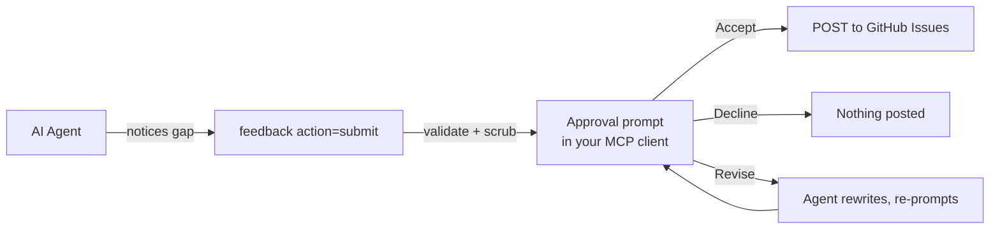

# Feedback

`feedback(submit)` files a GitHub issue against the ue-mcp tracker describing a tool gap, so maintainers can close it with a native handler. The flow is gated on explicit user approval (no agent-mediated consent), and the body is server-side scrubbed for credentials and personal/project identifiers before anything leaves your machine.

## How it works



1. Agent calls `feedback(action="submit")` with `title`, `summary`, and either `pythonWorkaround` or `idealTool`.
2. Server validates the submission (rejects placeholder titles, meta-apology phrases, too-short summaries, etc.).
3. Server assembles the body, applies a credential scrub pass and a privacy redaction pass ([jump to section](#what-gets-scrubbed)).
4. Server requests an **MCP elicitation** — your client surfaces an approval prompt with the full body, an optional revisions text field, and an Accept / Decline action.
5. Based on your choice the server submits the POST, returns a revision directive to the agent, or discards.

## Feedback modes

The default is **interactive** — every `feedback(submit)` blocks on the MCP elicitation approval prompt. Two other modes exist for autonomous / long-running agent sessions where waiting for human input on every submission isn't acceptable. Set the mode in `.ue-mcp.json` or via the `UE_MCP_FEEDBACK_MODE` env var (env wins). The agent has no surface to change the mode — it's set by the human running the server.

| Mode | What happens on `feedback(submit)` | When to use it |
|---|---|---|
| `interactive` (default) | Server scrubs + opens the elicitation prompt; you Accept / Decline / request revisions. Nothing posts without explicit human approval. | Default. Use whenever a human is at the keyboard. |
| `auto-approve` | Server scrubs + posts directly to GitHub. No prompt. | Long-running unattended agent sessions where you trust the agent's title/summary judgment. **Still applies the credential and privacy scrubs.** |
| `defer` | Server scrubs + writes the payload to `~/.ue-mcp/pending-feedback/<id>.json` instead of posting. No prompt, no network call. | Long-running unattended agent sessions where you want to review what would have been filed before any of it leaves the machine. Use `npx ue-mcp feedback list/show/approve/discard` to act on the queue afterward. |

Example `.ue-mcp.json`:

```json
{
  "feedback": { "mode": "defer" }
}
```

Or for a one-off agent run:

```bash
UE_MCP_FEEDBACK_MODE=defer npx ue-mcp ./MyGame.uproject
```

### Reviewing deferred submissions

```bash
npx ue-mcp feedback list             # show pending entries
npx ue-mcp feedback show <id>        # full title + body + labels
npx ue-mcp feedback approve <id>     # POST to GitHub, then remove
npx ue-mcp feedback discard <id>     # delete without posting
```

Deferred entries are stored at `~/.ue-mcp/pending-feedback/<id>.json` (override with `UE_MCP_PENDING_DIR`). The recorded `author` choice from the original `feedback(submit)` is honored on approve.

### Threat-model note

Both `auto-approve` and `defer` bypass the elicitation consent gate. The scrubs (credential + privacy) still run server-side regardless of mode — auto-approve doesn't downgrade the redaction story, it just removes the human-in-the-loop confirmation that the scrub caught everything you care about. Use defer instead if you want unattended operation **with** human review before anything ships.

## The approval prompt

The prompt the elicitation request opens has:

- The exact body that would post to GitHub (already redacted)
- A line declaring who the issue will author as (`@your-github-user` or `ue-mcp-feedback bot`)
- A `Submit with revisions (optional)` text field
- Your MCP client's built-in **Accept** / **Decline** action buttons

Outcomes:

| Click | Revisions field | Result |
|---|---|---|
| Accept | empty | The body is POSTed to the public tracker |
| Accept | filled in | Server returns your notes to the agent; the agent rewrites and triggers a fresh approval prompt for the revised body. Nothing posts until you re-approve. |
| Decline | (any) | Discarded. The agent receives a declined directive and stops. |

The agent has no way to bypass this prompt or forge a response — the consent signal comes from your client's UI, not from a tool result.

!!! info "Requires elicitation support"
    `feedback(submit)` requires the connected MCP client to advertise the `elicitation` capability. Claude Code 2.1.76+ supports it. If your client does not, the call returns a `feedback.blocked` directive with `code: "elicitation_unsupported"` instead of posting.

## Authorship

The `author` parameter is an enum with two values:

- `author: "user"` (default) — issue is authored by your real GitHub account via a cached OAuth token
- `author: "bot"` — issue is authored anonymously by the `ue-mcp-feedback[bot]`

If `author="user"` and no OAuth token is cached, the call returns an `auth_required` directive. Run `npx ue-mcp auth` to authorize, or call with `author="bot"` to post anonymously.

### Authorizing as your GitHub user

```bash
npx ue-mcp auth
```

Runs the GitHub device flow: prompts you to open a URL, enter a code, and authorize the `ue-mcp-feedback` GitHub App. On success the token is cached at `~/.ue-mcp/auth.json` (mode 600) and every subsequent `feedback(submit)` defaults to authoring as your user.

This same step is offered inside `npx ue-mcp init` when you opt into the feedback prompt hook. Run `auth` standalone if you skipped that and want to authorize later.

## What gets scrubbed

Two passes run server-side on the assembled title and body, before either reaches the approval prompt or the GitHub POST. The agent cannot bypass them or see the pre-scrubbed bytes.

### Credential scrub

Common credential shapes are replaced with `[REDACTED]`:

- GitHub PATs and App tokens (`ghp_`, `gho_`, `ghu_`, `ghs_`, `ghr_`, `github_pat_…`)
- AWS access key IDs (`AKIA…`, `ASIA…`)
- Slack tokens (`xoxb-`, `xoxp-`, etc.)
- Stripe live/test secret keys (`sk_live_`, `sk_test_`)
- Anthropic API keys (`sk-ant-…`)
- OpenAI keys (`sk-…`)
- JSON Web Tokens (`eyJ…eyJ…`)
- PEM blocks (`-----BEGIN … PRIVATE KEY-----`)
- Env-style assignments where the key name names a secret (`PASSWORD=`, `TOKEN=`, `API_KEY=`, etc.)

Novel shapes can pass through. Read the body on the approval prompt before clicking Accept.

### Privacy scrub

Personal and project identifiers are replaced with stable placeholders:

| What | Replacement |
|---|---|
| Absolute project root path | `REDACTED_PROJECT_ROOT` |
| OS home directory path | `REDACTED_HOME` |
| Project name (whole word, case-insensitive) | `REDACTED_PROJECT` |
| OS username (whole word, case-insensitive) | `REDACTED_USER` |

Path matching covers both slash and backslash separator conventions so the same path is caught whether it came from `execute_python` output, a JSON config, or a console trace. Word-boundary matching avoids substring false positives (`Davidson` keeps the `d`, `Valedictory` keeps the `V`).

Class, component, and actor names are **not** redacted automatically — the agent often needs to reference them to describe the gap. Use the **Submit with revisions** field on the approval prompt to request additional case-by-case redactions; the agent will rewrite and bring you a fresh prompt.

## Submit parameters

| Parameter | Required | Description |
|---|---|---|
| `title` | Yes | Short title describing the tool gap. At least 10 characters, no placeholder phrases. |
| `summary` | Yes | What was attempted and why the native tool fell short. At least 40 characters. |
| `pythonWorkaround` | Conditional | The `execute_python` code used as a workaround. Either this or `idealTool` is required; if omitted, the server checks for tracked session workarounds. |
| `idealTool` | Conditional | What tool/action should handle this natively (e.g. `blueprint(action='set_variable_default')`). Either this or `pythonWorkaround` is required. |
| `author` | No | `"user"` (default) or `"bot"`. See [Authorship](#authorship). |

## Example

```text
feedback(action="submit",
  title="Cannot set default values for Blueprint variables",
  summary="Tried to set a default value on a Blueprint variable. add_variable creates the variable but there's no action to set its default. Had to use execute_python to access the variable's DefaultValue property directly.",
  pythonWorkaround="import unreal; bp = unreal.load_asset('/Game/BP_Player'); ...",
  idealTool="blueprint(action='set_variable_default', assetPath, name, defaultValue)"
)
```

The agent makes the call; you see the approval prompt; you click Accept (with or without revisions) or Decline.

## Claude Code prompt hook

`npx ue-mcp init` offers (opt-in, default off) to install a Claude Code PostToolUse hook that fires after every `execute_python` call. The hook injects a system message asking the agent to surface the workaround to you and offer `feedback(submit)`. Without the hook, the agent will only file feedback if you ask for it directly.

The hook lives in `<project>/.claude/settings.json`. Its path is also recorded in `<project>/.ue-mcp.json` under `installedHooks[]` so re-running init can find and remove it cleanly. Remove all installed hooks manually with:

```bash
npx ue-mcp uninstall-hooks
```

The hook handler self-gates: if `feedback` is in `.ue-mcp.json` `disable[]` (or no `.ue-mcp.json` is reachable from the cwd), the hook silently no-ops even if the matcher is still in `settings.json`.

## Security model

- **The agent is the adversary for the consent step.** The MCP elicitation prompt is rendered by your client, and the response comes back to the server over the protocol — the agent has no IPC to forge an approval.
- **The redaction passes are non-bypassable.** They run before the body reaches the elicitation prompt or `submitFeedback`, and the agent never sees the pre-scrubbed bytes.
- **`author="bot"` uses an embedded GitHub App key.** The published npm package contains the `ue-mcp-feedback` App's installation credential as an XOR-encoded asset (not a literal source string), so a casual `grep` over the source tree finds nothing of interest. This is not a security boundary — the cycle constant lives next to the blob — but it removes the affordance that lets an agent stumble on the key during routine source inspection. The App's permissions are scoped to `issues: write` on `db-lyon/ue-mcp`; the realistic blast radius of a leak is bot impersonation on this one repo (`ue-mcp-feedback[bot]` posting noise), not RCE or exfil. Server-side bot signing is the long-term fix, tracked in [#461](https://github.com/db-lyon/ue-mcp/issues/461).
- **Disable the category if you don't want it available.** Add `"feedback"` to `.ue-mcp.json`'s `disable[]` and the tool is not registered with the MCP server. The category checkbox lives in the **Agent behavior** section of `npx ue-mcp init` (default unchecked on fresh installs).

## For maintainers

Submitted issues carry the `agent-feedback` label and include:

- **Summary** — what the user was trying to do (post-scrub)
- **Ideal Tool/Action** — suggested native tool signature, if supplied
- **Python Workaround Used** — the workaround code (post-scrub), if supplied
- **Session Workaround Log** — every `execute_python` call recorded during the session (post-scrub)

These form a prioritized backlog of tool gaps to close.

## Resolving feedback issues

```bash
npx ue-mcp resolve <issue-number>
```

Fetches the issue, creates a branch, launches Claude Code to implement the fix, and opens a PR. See [Getting Started](getting-started.md#resolving-issues) for details.
