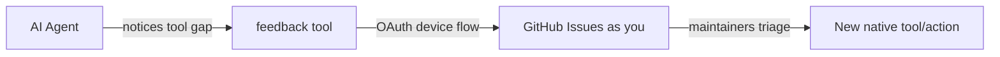

# Feedback

UE-MCP includes a built-in feedback system that helps improve tool coverage over time. When an AI agent has to fall back to `editor(action="execute_python")` because a native tool couldn't handle the task, it can submit structured feedback directly as a GitHub issue.

## How It Works



1. During a session, the agent uses `editor(action="execute_python")` as a workaround for something a native tool should handle
2. When the task is complete, the agent asks: *"I had to use custom Python scripts to get this done. Would you like to submit feedback to improve ue-mcp?"*
3. If the user agrees, the agent calls `feedback(action="submit")` with details about the gap
4. **First time only**: ue-mcp surfaces a GitHub device flow URL + code. You authorize the `ue-mcp-feedback` app once, the token persists in `~/.ue-mcp/auth.json`, and every subsequent submission authors the issue as you.
5. A GitHub issue is created on the [ue-mcp repository](https://github.com/db-lyon/ue-mcp), authored by your real GitHub user

## Authorship

By default issues are authored as the actual reporter via OAuth device flow. The first `feedback(submit)` on a fresh machine returns a directive with a verification URL and one-time code; after you authorize the `ue-mcp-feedback` GitHub App, the access token is cached at `~/.ue-mcp/auth.json` (mode 600) and reused.

If you'd rather submit anonymously as the bot, pass `useBot=true`. The bot is the fallback, not the default.

## Privacy

The agent is instructed to **strip project-specific details** from feedback submissions. Issues should describe the general capability gap, not your project's internals. You can review the issue content before the agent submits it.

## Submitting Feedback

The `feedback` tool has one action:

### `submit`

| Parameter | Required | Description |
|-----------|----------|-------------|
| `title` | Yes | Short title describing the tool gap (generic, no project details) |
| `summary` | Yes | What was attempted and why the native tool fell short |
| `pythonWorkaround` | No | The `execute_python` code used as a workaround |
| `idealTool` | No | What tool/action should handle this natively |

### Example

```
feedback(action="submit",
  title="Cannot set default values for Blueprint variables",
  summary="Tried to set a default value on a Blueprint variable. add_variable creates the variable but there's no action to set its default. Had to use execute_python to access the variable's DefaultValue property directly.",
  pythonWorkaround="import unreal; bp = unreal.load_asset('/Game/BP_Player'); ...",
  idealTool="blueprint(action='set_variable_default', assetPath, name, defaultValue)"
)
```

## For Maintainers

Feedback issues are created with the `agent-feedback` label and include:

- **Summary** — what the user was trying to do
- **Ideal Tool/Action** — suggested native tool signature
- **Python Workaround** — the code that solved it, useful for implementing the native handler

These issues form a prioritized backlog of tool gaps to close.

## Claude Code Hooks

If you ran `npx ue-mcp init` and selected "Agent behavior" hooks, Claude Code will automatically prompt agents to submit feedback whenever they fall back to `execute_python`. This is a Claude Code [PostToolUse hook](https://docs.anthropic.com/en/docs/claude-code/hooks) — it fires deterministically after the tool call, not as a suggestion the agent can ignore.

The hook is configured in your project's `.claude/settings.json` and calls `npx ue-mcp hook post-tool-use` under the hood.

## Resolving Feedback Issues

Once feedback issues are triaged, anyone can resolve them:

```bash
npx ue-mcp resolve <issue-number>
```

This fetches the issue, creates a branch, launches Claude Code to implement the fix, and opens a PR. See [Getting Started](getting-started.md#resolving-issues) for details.
