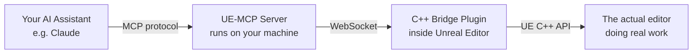

# Getting Started

This guide walks you from **never having heard of UE-MCP** to **your AI assistant placing actors and reading blueprints in your Unreal project**.

It assumes nothing. If you already know what MCP is and you have Node.js installed, jump straight to [Step 4: Install UE-MCP](#step-4-install-ue-mcp).

---

## What is UE-MCP?

UE-MCP is a bridge that lets an **AI assistant** (Claude, Cursor, etc.) talk directly to the **Unreal Editor**.

Think of it this way: instead of you opening menus, dragging actors, and typing into the Blueprint editor, you tell the AI what you want and *it* does the clicking. The AI can read your level, write blueprints, place actors, author materials, sculpt landscape, set up Niagara VFX, configure replication — anything you can do in the editor, the AI can drive on your behalf.

Under the hood it's two pieces talking to each other:



You install both pieces once. After that, every time you open your AI client, it can drive your editor.

---

## What is MCP?

**MCP** stands for **Model Context Protocol**. It's an open standard from Anthropic that lets AI models talk to external tools — your filesystem, a database, a 3D editor, anything that exposes an "MCP server".

You don't need to understand the protocol itself. You just need to know:

1. Your AI client (Claude Code, Claude Desktop, Cursor, etc.) is the **MCP client**.
2. UE-MCP is an **MCP server**.
3. You tell the client where the server lives, and the AI can suddenly use everything the server exposes.

That's the whole concept.

---

## Step 1: Prerequisites

You need three things on your machine. Check each one before continuing.

### Unreal Engine 5.4–5.7

UE-MCP supports **Unreal Engine 5.4 through 5.7**. If you don't have it yet, install it from the [Epic Games Launcher](https://www.unrealengine.com/en-US/download).

You also need an actual **UE project** (a folder with a `.uproject` file in it) to attach UE-MCP to. If you've never made one, open the Epic Games Launcher → Library → Unreal Engine → Launch → create a new "Blank" or "Third Person" project. Remember where you saved it — you'll point UE-MCP at that folder in a moment.

### Node.js 18 or newer

**Node.js** is a runtime that lets your computer execute JavaScript programs outside a browser. UE-MCP is written in TypeScript (which compiles to JavaScript) and runs on Node.js. You don't need to *learn* Node.js — you just need it installed.

1. Go to [nodejs.org](https://nodejs.org/) and download the **LTS** (Long-Term Support) version. Anything 18.x or newer works; 22.x LTS is recommended.
2. Run the installer. Accept the defaults.
3. Open a fresh terminal (PowerShell on Windows, Terminal on macOS) and verify:

```bash
node --version
```

You should see something like `v22.11.0`. If you see "command not found", restart your terminal — the installer's PATH change doesn't apply to terminals that were already open.

!!! warning "What's a terminal?"
    A **terminal** is the text window where you type commands.

    - **Windows**: press `Win + X` → "Terminal" (or "Windows PowerShell")
    - **macOS**: press `Cmd + Space`, type "Terminal", press Enter
    - **Linux**: you almost certainly know this already

### An MCP-capable AI client

You need at least one of these installed:

| Client | What it is | Install |
|---|---|---|
| **Claude Code** | Anthropic's official CLI agent. Best fit for UE-MCP. | [docs.anthropic.com/claude-code](https://docs.anthropic.com/en/docs/claude-code) |
| **Claude Desktop** | The Claude desktop app. | [claude.ai/download](https://claude.ai/download) |
| **Cursor** | AI-powered code editor based on VS Code. | [cursor.com](https://cursor.com) |

You only need **one**. Pick whichever you already use, or start with Claude Code if you're choosing fresh.

---

## Step 2: Pick Your Project

UE-MCP attaches to one Unreal project at a time. Find the `.uproject` file you want to use:

```
C:/Users/you/UnrealProjects/MyGame/MyGame.uproject
```

You'll need the full path. Copy it now.

!!! tip "On Windows, use forward slashes"
    Even on Windows, write paths with forward slashes (`C:/Users/...`) in MCP config files. Backslashes need escaping in JSON and cause confusion. Forward slashes work everywhere.

---

## Step 3: Close the Editor

If your Unreal Editor is currently open with the project you're about to attach, **close it first**. The setup step deploys a C++ plugin into the project, and the editor needs to be closed so it can pick up the new plugin on next launch.

---

## Step 4: Install UE-MCP

Open a terminal and run:

```bash
npx ue-mcp init
```

That's it. `npx` is a tool that ships with Node.js — it downloads `ue-mcp` from the npm registry and runs the interactive installer. The first time you run it, expect a 30-second download. After that it's cached.

!!! info "What `npx ue-mcp init` actually does"
    1. Asks for your `.uproject` path (or auto-detects it if you ran the command from inside the project folder).
    2. Asks which **tool categories** you want enabled. Each category (`level`, `blueprint`, `material`, etc.) registers a set of actions the AI can call. Default = all on.
    3. Copies the C++ bridge plugin into `<YourProject>/Plugins/UE_MCP_Bridge/`.
    4. Edits your `.uproject` to enable the bridge plugin and any required UE plugins (Niagara, PCG, GameplayAbilities, EnhancedInput).
    5. Detects which MCP clients you have installed (Claude Code, Claude Desktop, Cursor) and writes the config for each.
    6. **Claude Code only**: optionally installs a hook that prompts the AI to report tool gaps when it falls back to raw Python.

You can also pass the project path inline to skip the prompt:

```bash
npx ue-mcp init C:/Users/you/UnrealProjects/MyGame/MyGame.uproject
```

When the installer finishes, you'll see a summary listing what was deployed and which client configs were written.

---

## Step 5: Restart the Editor

Open your Unreal project. The editor will detect the new plugin (`UE_MCP_Bridge`) and ask if you want to compile it. Say yes. This takes about 30-60 seconds the first time.

When the editor finishes loading, the bridge starts automatically and listens for connections on `ws://localhost:9877`.

### Verify the bridge started

Inside the editor, open **Window → Output Log** (or **Window → Developer Tools → Output Log** depending on your version). In the filter box at the top, type `LogMCPBridge`. You should see:

```
LogMCPBridge: UE-MCP Bridge server started on ws://localhost:9877
```

If you see that line, the editor side is ready.

If you don't see it, jump to [Troubleshooting](troubleshooting.md).

---

## Step 6: Talk to Your AI

Open your AI client. The MCP server is launched on demand, so you don't need to start anything yourself — your client will spawn `ue-mcp` the first time the AI invokes a tool.

### First sanity check

Ask the AI:

> Run `project(action="get_status")` and tell me what you see.

The AI will call the `project` tool with `action: "get_status"`. You should get back something like:

```json
{
  "mode": "live",
  "projectName": "MyGame",
  "projectPath": "C:/Users/you/UnrealProjects/MyGame/MyGame.uproject",
  "engineAssociation": "5.6",
  "bridgeConnected": true
}
```

`bridgeConnected: true` means everything is wired up correctly. You're ready.

### A few good first prompts

Try these to see what UE-MCP can do:

> What's in my level right now?

(The AI will call `level(action="get_outliner")` and list every actor.)

> List all the blueprints in /Game/Blueprints.

(The AI will call `asset(action="list", directory="/Game/Blueprints", typeFilter="uasset")`.)

> Place a directional light at (0, 0, 500) and a SkyLight at the origin, then build lighting at preview quality.

(The AI orchestrates `level(action="spawn_light")` twice and `level(action="build_lighting")`.)

> Run the Neon Shrine demo to show me what you can build.

(The AI will step through a 19-step procedural scene — see [Neon Shrine Demo](neon-shrine-demo.md).)

---

## Updating UE-MCP

When a new version of UE-MCP is released, update both pieces (the npm package and the deployed C++ plugin) with one command from your project directory:

```bash
npx ue-mcp update
```

The updater redeploys the C++ bridge plugin and tells you whether you need to restart the editor. Re-running this is safe — it's idempotent.

---

## Switching Projects

A single UE-MCP install can attach to any project. To switch at runtime without restarting your AI client, ask the AI:

> Switch to the project at `C:/Users/you/UnrealProjects/OtherGame/OtherGame.uproject`.

Behind the scenes that's `project(action="set_project", projectPath="...")`. UE-MCP will deploy the bridge into the new project and reconnect.

---

## Manual Configuration (skip the installer)

If you'd rather wire things up by hand, skip `npx ue-mcp init` and edit the MCP config for your client directly.

=== "Claude Code"

    `.mcp.json` in your project root:
    ```json
    {
      "mcpServers": {
        "ue-mcp": {
          "command": "npx",
          "args": ["ue-mcp", "C:/path/to/MyGame.uproject"]
        }
      }
    }
    ```

=== "Claude Desktop"

    `claude_desktop_config.json` (location varies by OS — see [Claude's docs](https://modelcontextprotocol.io/quickstart/user)):
    ```json
    {
      "mcpServers": {
        "ue-mcp": {
          "command": "npx",
          "args": ["ue-mcp", "C:/path/to/MyGame.uproject"]
        }
      }
    }
    ```

=== "Cursor"

    `.cursor/mcp.json` in your project root:
    ```json
    {
      "mcpServers": {
        "ue-mcp": {
          "command": "npx",
          "args": ["ue-mcp", "C:/path/to/MyGame.uproject"]
        }
      }
    }
    ```

You'll still need to deploy the C++ plugin into your `.uproject`. The first time the server runs against a project it auto-deploys, but you can also do it explicitly:

```bash
npx ue-mcp update C:/path/to/MyGame.uproject
```

Then restart the editor.

---

## Resolving GitHub Issues

If you find a bug or missing feature, file an issue at [github.com/db-lyon/ue-mcp/issues](https://github.com/db-lyon/ue-mcp/issues). Anyone can pick up an open issue and let Claude Code take a swing at it:

```bash
npx ue-mcp resolve 16
```

This fetches issue #16, creates a `resolve/<n>` branch, launches Claude Code with the issue body as context, then opens a PR when it's done. Requires the `claude` and `gh` CLIs to be installed.

---

## Where to Go Next

- **[Tool Reference](tool-reference.md)** — every tool and every action, with parameters
- **[Architecture](architecture.md)** — what's actually happening when you call a tool
- **[Flows](flows.md)** — chain multiple actions into one reusable workflow
- **[Configuration](configuration.md)** — `.ue-mcp.json` options and per-client config
- **[Troubleshooting](troubleshooting.md)** — connection errors, build errors, asset path errors
- **[Neon Shrine Demo](neon-shrine-demo.md)** — a guided 19-step scene build
