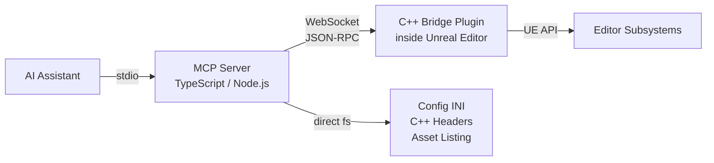

# UE-MCP

**Unreal Engine Model Context Protocol Server** - lets AI assistants drive the Unreal Editor through <!-- count:tools -->19<!-- /count --> category tools covering <!-- count:actions -->450+<!-- /count --> actions.

UE-MCP is a bridge between an AI client (Claude Code, Claude Desktop, Cursor, etc.) and the Unreal Editor. It runs a TypeScript MCP server on your machine, which talks over WebSocket to a C++ plugin running inside the editor. The result: your AI can place actors, write blueprints, author materials, sculpt landscape, set up Niagara VFX, configure replication, run PIE, build the project — anything the editor can do.

Filesystem-based reads (config INI parsing, C++ header reflection, asset directory scanning) work even when the editor isn't running, so the AI can explore project structure and source code without a live editor.

## New Here?

Start with **[Getting Started](getting-started.md)**. It assumes zero knowledge — no Node.js, no MCP, no command line — and walks you all the way to your AI placing actors in your level.

## What Can It Do?

| Category | Examples |
|----------|----------|
| **Levels** | Place/move/delete actors, spawn lights and volumes, manage splines |
| **Blueprints** | Read/write graphs, add nodes, connect pins, compile, CDO property access |
| **Materials** | Create materials and instances, author expression graphs, set parameters |
| **Assets** | CRUD, import meshes/textures/animations, datatables |
| **Animation** | Read/create anim blueprints, montages, blendspaces, skeletons |
| **VFX** | Create and configure Niagara systems and emitters |
| **Landscape** | Sculpt terrain, paint layers, import heightmaps |
| **PCG** | Author and execute Procedural Content Generation graphs |
| **Foliage** | Painting, types, instance queries |
| **Audio** | SoundCues, MetaSounds, ambient audio |
| **UI** | UMG widget trees, editor utility widgets and blueprints |
| **Gameplay** | Physics, collision, navigation, AI (behavior trees, EQS, perception), input |
| **GAS** | Gameplay Ability System - attributes, abilities, effects, cues |
| **Networking** | Replication, dormancy, relevancy, net priority |
| **Editor** | Console commands, Python escape hatch, PIE, viewport, sequencer, build pipeline, logs |
| **Reflection** | Class/struct/enum introspection, gameplay tags |
| **Project** | Status, INI config, C++ source/header parsing, build |
| **Demo** | Built-in 19-step Neon Shrine procedural scene |
| **Feedback** | Submit tool-gap reports as GitHub issues |

Plus a **flow engine** that lets you chain any of these into multi-step YAML workflows with rollback, retries, and step references — see [Flows](flows.md).

## Navigation

- **[Getting Started](getting-started.md)** - Zero-to-running walkthrough for first-time users
- **[Architecture](architecture.md)** - How the TypeScript server, C++ plugin, and editor fit together
- **[Tool Reference](tool-reference.md)** - All <!-- count:tools -->19<!-- /count --> tools with every action and its parameters
- **[Flows](flows.md)** - Multi-step YAML workflows, custom tasks, hooks, rollback
- **[Configuration](configuration.md)** - `.ue-mcp.json` and MCP client config
- **[Neon Shrine Demo](neon-shrine-demo.md)** - 19-step procedural scene walkthrough
- **[Feedback](feedback.md)** - Agent feedback system for improving UE-MCP
- **[Troubleshooting](troubleshooting.md)** - Connection issues, build issues, asset path issues
- **[Development](development.md)** - Building from source, testing, contributing
- **[Handler Conventions](handler-conventions.md)** - Idempotency and rollback rules for C++ handlers
